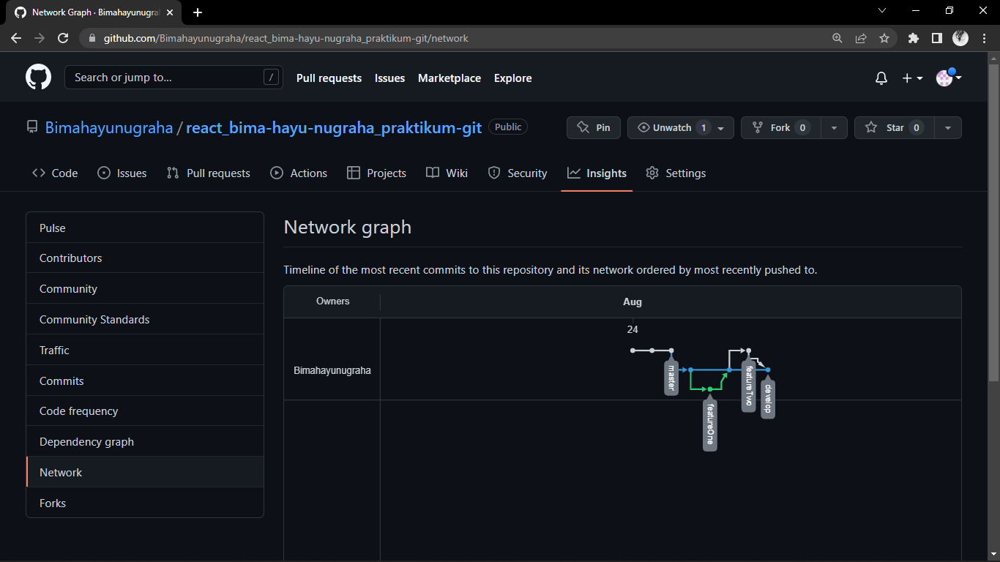

# (03) Version Control and Branch Management (Git)
## Resume

Dalam materi ini point yang dipelajari adalah:
1. Tentang Versioning dan Version Control System (VCS)
2. Perintah-perintah dan file yang ada di Git
3. Pengertian workflow dan cara optimalisasi workflow yang baik

### Tentang Versioning dan Version Control System (VCS)
Versioning adalah **mengatur versi** dari _**source code**_ program pada sebuah _project_. Dalam versioning terdapat 3 _tools_, yaitu _Version Control System (VCS)_, _Source Code Manager (SCM)_, dan _Revision Control System (RCS)_. _Tool_ yang sering banyak digunakan adalah _VCS_. _VCS_ terdiri dari 3 versi yaitu:\
**a. Single User**\
_Single user_ mengembangkan _Unix_ untuk memanajemen sebuah tugas yang masih bersifat _localized_. Versi ini masih menggunakan komputer untuk memanajemen OS yang bersifat _Unix_ dengan SCCS atau RCS dalam artian memanajemen projek yang berbasis local, jadi antara komputer satu sama lain masih belum terhubung. Tetapi sudah terlacak di local.\
**b. Centralized**\
Pada _centralized_ terdapat CVS, Perforce, Subversion, dan Microsoft Team Foundation Server. Versi ini sudah mempunyai _server_ pusat. Pada saat developer menggunakan _centralized_, kemudian servernya mati. Maka, developer tidak bisa menggunakannya lagi karena dalam pengambilan data yang dilakukan developer langsung mengambil datanya dari _server_ pusat, sehingga jika _server_ mati data tidak bisa diambil.\
**c. Distributed**\
Pada _distributed_ terdapat _tools_ yang banyak digunakan oleh developer dan paling efektif yaitu Git. Git dikembangkan pada tahun 2005 dan digunakan untuk mengupload _file_ ke _server_, tetapi dalam mengedit _file_ tetap dilakukan di local. Untuk dapat mengupload filenya ke server harus tersinkronisasi terlebih dahulu ke _server_ tersebut dengan menggunakan perintah - perintah yang ada di Git.

Pada VCS terdapat _tool_ yang paling populer yaitu Git. Git merupakan salah satu _Version Control System (VCS)_ populer yang banyak digunakan oleh para developer dalam mengembangkan _software_ secara bersama-sama. Git dapat melakukan pelacakan pada setiap perubahan dari _project_ dan berkolaborasi dengan developer lain. Git ini juga merupakan sistem yang terdistribusi. Dalam git terdapat _Git Repository_ yang digunakan untuk menyimpan folder _project_ yang telah dibuat.

### Perintah-perintah yang ada di Git
Perintah-perintah yang ada di Git dapat dikategorikan sebagai berikut:
1. **Setting Configuration**
   - Perintah git init\
     Perintah ini digunakan untuk menginisialisasi git dengan membuat folder baru yang bernama .git pada projek yang ingin di upload.
   - Perintah git clone\
     Perintah ini digunakan untuk melakukan _clone_ projek dari github dengan menarik semua folder dan _file_ nya.
   - Perintah git config\
     Perintah ini digunakan untuk mengatur konfigurasi Git ke global atau local.
2. **Saving Changes**
   - Perintah git add\
     Perintah ini digunakan untuk memindahkan _file_ yang ingin di upload ke _staging area_.
   - Perintah git commit\
     Perintah ini digunakan untuk membuat _file_ yang ingin di upload masuk ke dalam _git repository_ dan menuliskan pesannya.
   - Perintah git diff\
     Perintah ini digunakan untuk mengetahui perubahan yang terjadi pada _file_ yang diubah secara detail.
   - Perintah git stash\
     Perintah ini digunakan untuk menyimpan sementara perubahan file ke dalam _stash area_.
   - Perintah git stash apply\
     Perintah ini Untuk mengembalikan perubahan yang sudah disimpan di _stash area_.
   - File .gitignore\
     _File_ ini digunakan untuk mengeksekusi _file_ yang dikecualikan saat upload ke github.
3. **Inspecting Repository**
   - Perintah git log\
     Perintah ini digunakan untuk melihat list perubahan yang dilakukan. 
   - Perintah git log --oneline\
     Perintah ini digunakan untuk melihat perubahan hanya dalam satu line.
   - Perintah git reset\
     Perintah ini digunakan untuk mengembalikan sebuah perubahan ke titik tertentu. Dalam perintah _git reset_ terdapat dua jenis yaitu _--soft_ dan _--hard_. _--soft_      artinya ketika ingin kembali ke suatu titik, perubahan yang dilakukan akan tetap terlacak dan ada di _staging area_, sedangkan _--hard_ artinya ketika ingin kembali ke suatu titik, perubahan yang dilakukan akan hilang dari _staging area_.
 4. **Syncing**
    - Perintah git push\
      Perintah ini digunakan untuk mengirimkan _file_ ke _git server_.
    - Perintah git fetch\
      Perintah ini digunakan untuk mengambil data yang ada di dalam _server_.
    - Perintah git pull\
      Perintah ini digunakan untuk menarik data, kemudian di _merge_ ke branch yang dibuat.
 5. **Braches**
    - Perintah git branch\
      Perintah ini digunakan Untuk dapat melihat list dari _branch_ yang tersedia pada _repository_. 
    - Perintah git branch --list\
      Perintah ini digunakan untuk dapat melihat semua _branch_ yang tersedia pada _repository_.
    - Perintah git branch <branch>\
      Perintah ini digunakan untuk membuat _branch_ yang baru. 
    - Perintah git branch -D <branch>\
      Perintah ini digunakan untuk menghapus _branch_ yang diinginkan.
    - Perintah git branch -a\
      Perintah ini digunakan untuk melihat list dari _remote branch_.
    - Perintah git merge\
      Perintah ini digunakan untuk menggabungkan perubahan dari _branch_ yang dilakukan perubahan ke _branch_ yang dituju. Dalam perintah ini terdapat dua jenis yaitu _--ff_ dan _--no-f_.
    - Perintah pull requests\
      Perintah ini dapat dilakukan secara langsung di github yang digunakan untuk melakukan kontribusi pada _repository_ yang diinginkan.

### Pengertian workflow dan cara optimalisasi workflow yang baik
_Workflow_ adalah alur dari penggunaan Git pada **Github** atau **Gitlab**.\
Cara optimalisasi _workflow_ yang baik adalah dengan adanya _branch master_ yang digunakan untuk sisi _production_. Terdapat juga _branch develop_ yang digunakan untuk penggabungan dan pengembangan, pengambilan titik dari setiap _feature_ bukan diambil dari _branch master_, tetapi diambil dari _branch develop_, misalnya _featureA_ dan _featureB_. Kemudian, dimasukkan lagi ke _branch develop_. Untuk melakukan coding tidak dilakukan di _branch develop_, tetapi di _branch featuare_. Jika dari _branch develop_ sudah pasti, selanjutnya dimasukkan ke _branch master_. 

## Task
### 1. Membuat repository github baru, melakukan upload project ke branch master, membuat 3 branch baru, dan melakukan merge ke branch develop
Pada tugas ini, pertama kali yang dilakukan adalah membuat _repository_ github baru, kemudian melakukan upload _project_ ke _branch master_. Lalu membuat 3 _branch_ baru yaitu _branch _develop_, _featureOne_, dan _featuretwo_ serta melakukan _merge_ untuk _branch featureOne_ dan _featureTwo_ ke _branch develop_.

Berikut adalah link repository github pengumpulan tugas praktikum git:\
[Tugas Praktikum Git](https://github.com/Bimahayunugraha/react_bima-hayu-nugraha_praktikum-git)

Berikut adalah source code dari tugas praktikum git untuk melakukan merge branch:\
[App.js](./praktikum/src/App.js)

Screenshot dari hasil insight network:

