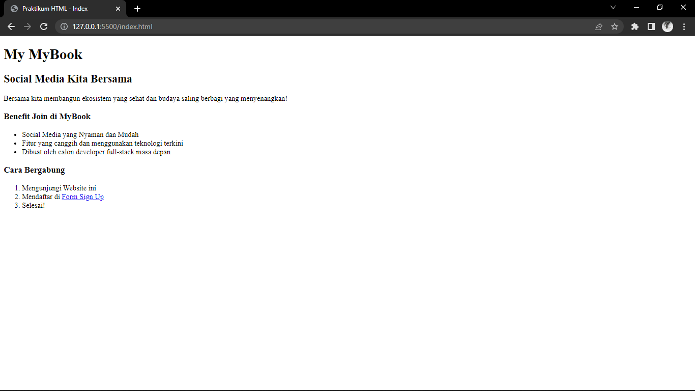

# (05) HTML
## Resume

Dalam materi ini point yang dipelajari adalah
1. Tentang HTML
2. Dokumentasi HTML
3. Tag dan List yang ada pada HTML

### Tentang HTML
_Front-end_ adalah sebuah bagian dari _website_ yang membuat tampilan yang menarik kepada pengguna. Dalam _front-end_ terdiri dari _HTML, JS,_ dan _CSS_. _HTML_ _**(Hypertext Markup Language)**_ sendiri adalah sebuah standar bahasa _markup_ yang digunakan secara luas untuk pembuatan struktur halaman _website_. _HTML_ memiliki kegunaan yaitu :
-	Membuat struktur konten dari halaman _website_
-	Mengatur tampilan dan isi dari halaman _website_
-	Membuat tabel dengan _tag HTML `**table**`_
-	Membuat _form_
-	Membuat gambar dengan _canvas_
-	Mempublikasikan halaman _website_ secara _online_

### Dokumentasi Html
| Tag Dokumentasi         | Keterangan       |
| --- | --- |  
| `<! DOCTYPE html>`      | Mendefinisikan **dokumen sebagai HTML5**       |
| `<html>`   | Elemen **_root_ dari halaman _HTML_** |
| `<head>`   | Berisi **informasi _meta_ tentang dokumen**|
| `<title>`   | Menentukan **judul untuk dokumen**|
| `<body>`   | Berisi **konten halaman yang terlihat**|

### Tag dan List yang ada pada HTML
Berikut adalah _tag_ yang ada pada HTML:
| Tag HTML         | Keterangan       |
| --- | --- |  
| `
`      | Menandakan **sekelompok elemen**       |
| `<h1> - <h6>`   | _Heading_ dibagi dari **heading 1 sampai 6** |
| `
`   | Menampilkan **elemen yang berisikan sebuah paragraf**|
| `<strong>`   | _Styling_ paragraf yang digunakan untuk **membuat _text_ lebih tebal**|
| `<em>`   | _Styling_ paragraf yang digunakan untuk **membuat _text_ menjadi _italic_**|
| `<s>`      | _Styling_ paragraf yang digunakan untuk **membuat _text_ dengan garis tercoret di ~~tengah~~**       |
| `<u>`   | _Styling_ paragraf yang digunakan untuk **membuat _text_ menjadi _underline_** |
| ` `   | _Styling_ paragraf yang digunakan untuk **membuat garis baru atau _line break_**|
| `<a>`   | Komponen yang digunakan untuk **membuat sebuah _link_**|
| ``   | Menampilkan **gambar pada _website_**|
| `<table></table>`      | Membuat **tabel** pada _HTML_       |
| `<tr></tr>`   | Menentukan **setiap baris** pada tabel |
| `<td></td>`   | Menentukan **setiap kolom** pada tabel|
| `<th<</th>`   | Menentukan **kolom** pada _header_ tabel|
| `<form></form>`   | Membuat **form**|
| `<ol></ol>`   | Menandai **item yang berurutan**|
| `<ul></ul>`   | Menandai **item yang tidak berurutan**|

Terdapat dua jenis list dalam _HTML_ yaitu:
1.	**Ordered List** adalah list yang berurutan dengan menggunakan _tag_ (`<ol`).
2.	**Unordered List** adalah list yang tidak berurutan dengan menggunakan _tag_ (`<ul>`).
Setiap item pada **Ordered List** dan **Undordered List** di deklarasikan menggunakan _tag_ `<li>`.

## Task
### 1. Membuat sebuah file `index.html` dengan menambahkan konten yang sudah disediakan dan pada text _*Form Sign Up*_ dibuat menjadi sebuah link yang mengarah ke halaman `form.html`

Pada tugas ini yaitu membuat sebuah _file_ dengan nama `index.html` dan menambahkan konten yang sudah disediakan pada soal tugas praktikum, kemudian pada _text_ **Form Sign Up** dibuat menjadi sebuah _link_ ketika di klik akan mengarahkan ke halaman `form.html`.

Berikut adalah _source code_ untuk membuat halaman pada `index.html`:

[index.html](./praktikum/index.html)

Berikut adalah hasil _output_ dari halaman `index.html`:

### 2. Membuat sebuah file `form.html` dengan menambahkan desain konten yang sudah disediakan pada soal tugas praktikum dan ketika form di submit, maka akan mengarahkan ke halaman `welcome.html`

Pada tugas ini yaitu membuat sebuah _file_ dengan nama `form.html` dan menambahkan desain konten yang sudah disediakan pada soal tugas praktikum dan ketika _form_ di _submit_ dengan mengklik pada _button_ **Submit atau Sign Up**, maka akan mengarahkan pengguna ke halaman `welcome.html`.

Berikut adalah _source code_ untuk membuat halaman pada `form.html`:

[form.html](./praktikum/form.html)

Berikut adalah hasil _output_ dari halaman `form.html`:

### 3. Membuat sebuah file dengan nama `welcome.html` dengan menambahkan desain konten yang sudah disediakan

Pada tugas ini yaitu membuat _file_ dengan nama `welcome.html` dan menambahkan desain konten yang sudah disediakan pada soal tugas praktikum.

Berikut adalah _source code_ untuk membuat halaman pada `welcome.html`:

[welcome.html](./praktikum/welcome.html)

Berikut adalah hasil _output_ dari halaman `welcome.html`:

