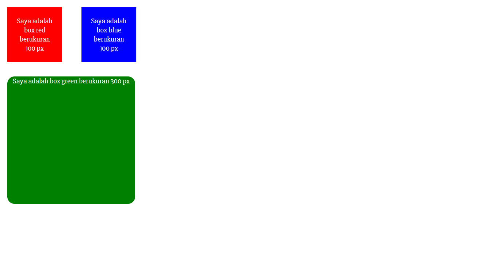
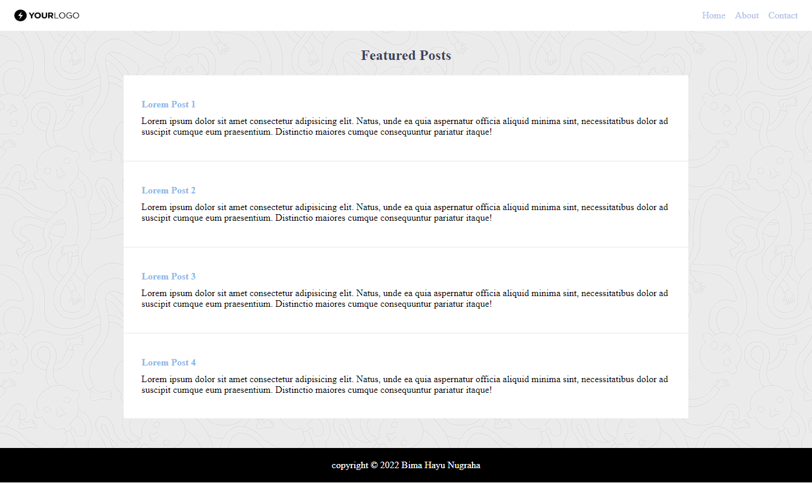

# (06) CSS
## Resume

Dalam materi ini point yang dipelajari adalah
1. Pengertian CSS
2. 3 cara menambahkan CSS ke dalam HTML
3. Beberapa styling pada CSS

### Pengertian CSS
_**CSS (Cascading Style Sheets)**_ adalah bahasa yang digunakan untuk menghias halaman _web_ dan mengatur posisi pada halaman _web_. 

### 3 cara menambahkan CSS ke dalam HTML
Untuk dapat menambahkan _CSS_ ke dalam _HTML_ terdapat 3 cara yaitu:

1.	External CSS\
Pada _external CSS_ cara yang dilakukan adalah menyisipkan _syntax_ seperti `<link rel=”stylesheet” href=”main.css”>` ke dalam _tag_ `<head>` di _HTML_. Extensi file _CSS_ ini adalah `.css`.
2.	Internal CSS\
Pada _internal CSS_ cara yang dilakukan adalah menambahkan _syntax_ `` ke dalam bagian _tag_ `<head>` atau `<body>`. Cara ini hanya dapat digunakan pada satu _file HTML_ saja.
3.	Inline CSS\
Pada _inline CSS_ cara yang dilakukan adalah menambahkan _syntax_ `<style>` ke dalam elemen tunggal di _HTML_. Cara ini hanya di prioritaskan untuk menerapkan _style_ yang unik.

### Beberapa styling pada CSS
Berikut adalah beberapa _styling_ pada CSS:

1.	CSS Selector\
Pola yang digunakan untuk memilih elemen yang ingin di lakukan _styling_. Untuk penanda _HTML_ ke dalam _CSS_ dapat menggunakan _selector_ **id** dan **class** adalah sebagai berikut:

    | Penanda         | Keterangan       |
    | --- | --- | 
    | **id** | Menggunakan penanda crash **(#)** |
    || Dalam satu elemen hanya dapat memiliki satu _tag_ **id** |
    || Dalam satu halaman tidak boleh terdapat dua penamaan **id** yang berbeda |
    | **class** | Menggunakan pendana **(.)** |
    || _Tag_ **class** dengan nama **class** yang sama dapat digunakan atau dipakai berulang-ulang pada satu halaman |
    || Satu elemen boleh memiliki lebih dari satu **class** yang berbeda-beda |
2.	CSS Grouping\
Beberapa _selector_ yang dapat dikelompokkan dalam deklarasi _styling_. Contohnya seperti `<selector>`, `<selector>`.
3.	CSS Font\
Beberapa _style font_ yang dapat diterapkan di _styling CSS_. Beberapa properti dalam _CSS font_ adalah sebagai berikut:

    | Style         | Keterangan       |
    | --- | --- | 
    | `font` | Menetapkan semua properti _font_ ke dalam satu deklarasi _styling_ |
    | `font-family` | Menentukan jenis kelompok _font_ yang ingin digunakan |
    | `font-size` | Menentukan untuk ukuran teks |
    | `font-weight` | Menentukan untuk ketebalan teks |
    | `font-style` | Menentukan _style_ untuk teks |
4.	CSS Margin dan Padding\
Digunakan untuk membuat ruang disekitar elemen.
5.	CSS Background\
Beberapa _style background_ yang ada di _CSS_. Properti yang ada di _CSS background_ adalah sebagai berikut:

    | Style         | Keterangan       |
    | --- | --- | 
    | `background-color` | Menetapkan untuk warna dari _background_ pada suatu elemen |
    | `background-image` | Menentukan gambar untuk dijadikan sebagai _background_ pada suatu elemen |
    | `background-repeat` | Perulangan untuk _background_ gambar |
    | `background-size` | Menentukan ukuran gambar untuk dijadikan sebagai _background_ |
    | `background-position` | Mengatur posisi awal _background_ gambar |
6.	CSS Link Event\
Beberapa _link event_ yang ada di _CSS_. Berikut adalah _CSS link event_:

    | Style         | Keterangan       |
    | --- | --- | 
    | `:hover` | Kondisi _style_ ketika _mouse_ berada di elemen, maka elemen tersebut akan menampilkan _hover_ |
    | `:active` | _Style_ ketika sebuah _link_ di klik |
    | `:visited` | _Style_ ketika sebuah _link_ telah di klik |
7.	CSS Display\
Menentukan tampilan pada elemen. Berikut adalah _CSS display_:

    | Style         | Keterangan       |
    | --- | --- | 
    | `block` | _Style_ yang dimulai pada baris baru dari kiri ke kanan |
    | `inline-block` | _Style_ yang membutuhkan lebar sesuai yang diperlukan |
    | `none` | Menyembunyikan sebuah elemen |
    | `flex` | Mengatur elemen beserta item didalamnya pada halaman _website_ |
    | `grid` | Mengatur elemen beserta item didalamnya pada halaman _website_ |
8.	CSS Table\
Membuat _style_ pada elemen _table_. Berikut adalah _CSS table_:

    | Style         | Keterangan       |
    | --- | --- | 
    |  `border` | Menambahkan _border_ pada elemen _table, th,_ dan _td_ |
    | `border-collapse` | Membuat _border_ pada tabel menjadi _single_ |
    | `nth-child(event)` | Membuat _background_ pada tabel menjadi _stripe_ |

## Task
### 1. Mengubah tampilan dari `file1.html` menjadi tampilan yang sudah ditentukan di soal praktikum CSS dan pembuatan halamam hanya menggunakan CSS.
Pada tugas ini yaitu mengubah tampilan dari `file1.html` menjadi tampilan yang sudah ditentukan di soal praktikum _CSS_ dengan ketentuan menggunakan _font-family: "Slabo 27px";_ dan _font-size: 20px;_. Pembuatan halamam hanya menggunakan _CSS_.

Berikut adalah _source code_ untuk membuat halaman pada `file1.html`:

[file1.html](./praktikum/file1.html)

Berikut adalah hasil _output_ dari halaman `file1.html`:

### 2. Membuat sebuah file dengan nama `file2.html` dengan melakukan desain halaman sesuai yang ditentukan di soal praktikum CSS.
Pada tugas ini yaitu membuat sebuah _file_ dengan nama `file2.html` dengan melakukan desain halaman sesuai yang ditentukan di soal praktikum _CSS_. Diberi kebebasan untuk memperbaiki bentuk dan _responsive_ di bagian _header_ yang terpenting letak dari _header_ sesuai dengan yang ditentukan.

Berikut adalah _source code_ untuk membuat halaman pada `file2.html`:

[file2.html](./praktikum/file2.html)

Berikut adalah hasil _output_ dari halaman `file2.html`:

    

