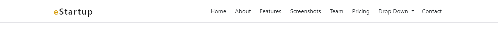
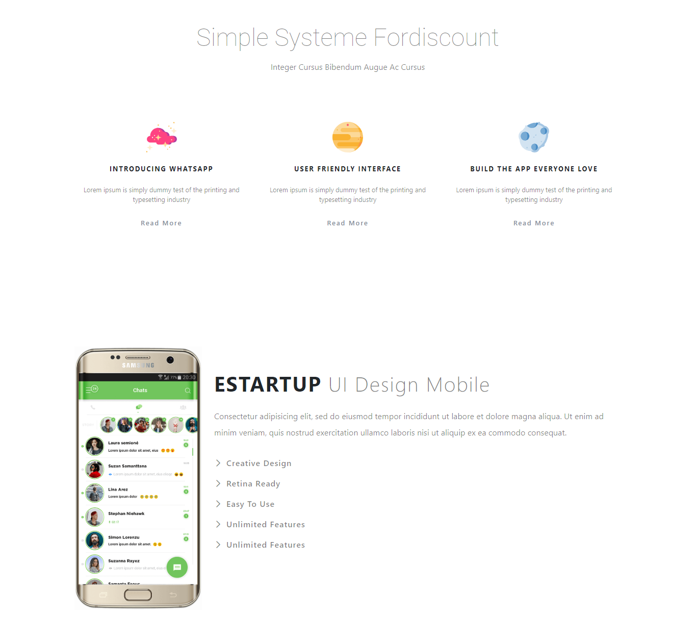
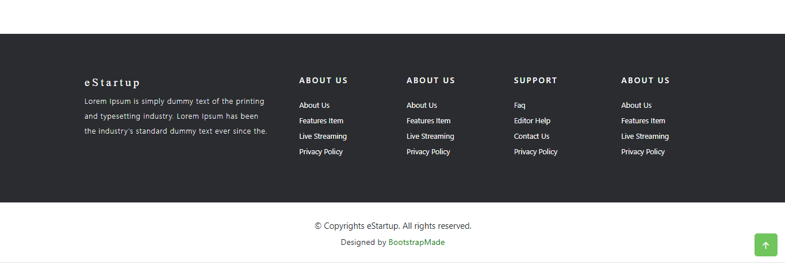
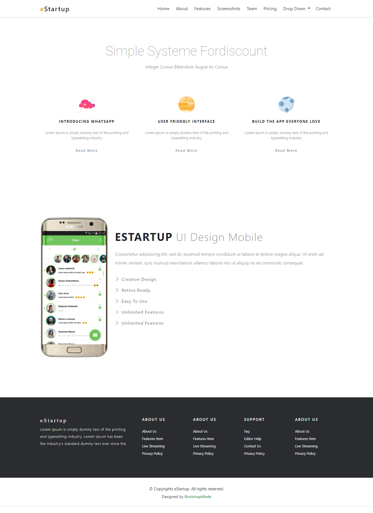
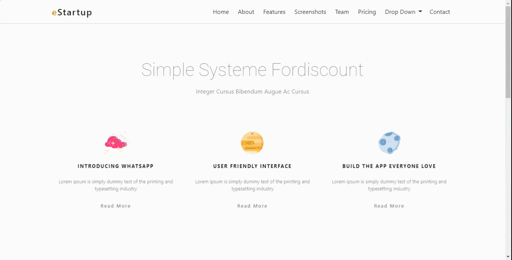

# (07) Bootstrap

## Resume

Point yang dipelajari adalah:

1. Pengertian Front End Framework
2. Pengertian dan cara menginstall Bootstrap
3. Beberapa class yang ada di Bootstrap

### Pengertian Front End Framework

_**Front End Framework**_ adalah sekumpulan aturan kode yang dapat digunakan secara langsung untuk mempermudah dalam _development_ suatu tampilan _website_. Pada _front end_ sendiri terdapat beberapa _framework_ yaitu _Bootstrap, Semantic UI, Motion UI, Material UI,_ dan lainnya.

### Pengertian dan cara menginstall Bootstrap

_**Bootstrap**_ adalah sebuah _framework_ atau _toolkit front end web development_ yang dirancang untuk mempermudah proses pengembangan _website responsive_ dan _mobile-first_ atau memprioritaskan perangkat smartphone dengan menyediakan berbagai fitur dan _syntax_ untuk desain template. _Bootstrap_ sangat banyak digunakan oleh _front end_ karena gratis, mudah dipelajari, pembuatan _website_ dengan cepat, dan mendukung tampilan yang _responsive_. Untuk memulai atau menginstall _Bootstrap_ terdapat beberapa cara yaitu:

1. Dapat mengunduh _file bootstrap_ secara langsung melalui _[download bootstrap](https://getbootstrap.com/docs/5.2/getting-started/download/)_
2. Dapat menggunakan _**CDN**_ pada _[bootstrap introduction](https://getbootstrap.com/docs/5.2/getting-started/introduction/)_
3. Dapat melakukan penginstalan _bootstrap_ dengan menggunakan `npm` atau `yarn` yaitu dengan mengetikkan perintah `npm install bootstrap@5.2.0` atau `yarn add bootstrap@5.2.0`

### Beberapa class yang ada di Bootstrap

Berikut adalah beberapa _class Bootstrap_ yang akan memudahkan dalam _layouting_ saat _development_ sebuah _website_:

| Class       | Fitur                                                            |
| ----------- | ---------------------------------------------------------------- |
| `container` | container, container-fuild                                       |
| `row`       | row                                                              |
| `column`    | col-sm-1 – col-sm-12, col-md-1 – col-md-12, col-lg-1 – col-lg-12 |
| `button`    | btn-primary, btn-sunccess, dan lainnya                           |

## Task

### 1. Membuat header atau navbar yang responsive.

Pada tugas ini yaitu membuat _**header**_ atau _**navbar**_ yang _responsive_ menggunakan _framework Bootstrap_ dengan tampilan dan bentuk yang sudah ditentukan pada soal praktikum materi **"Bootstrap"**.

Berikut adalah _source code_ untuk membuat _**header**_ atau _**navbar**_:

[index.html](./praktikum/src/index.html)

[style.css](./praktikum/assets/css/styles.css)

Berikut adalah hasil _output_ dari tampilan _**header**_ atau _**navbar**_:

### 2. Membuat body.

Pada tugas ini yaitu membuat _**body**_ menggunakan _framework Bootstrap_ dengan tampilan dan bentuk yang sudah ditentukan pada soal praktikum materi **"Bootstrap"**.

Berikut adalah _source code_ untuk membuat _**body**_:

[index.html](./praktikum/src/index.html)

[style.css](./praktikum/assets/css/styles.css)

Berikut adalah hasil _output_ dari tampilan _**body**_:

### 3. Membuat footer.

Pada tugas ini yaitu membuat _**footer**_ menggunakan _framework Bootstrap_ dengan tampilan dan bentuk yang sudah ditentukan pada soal praktikum materi **"Bootstrap"**.

Berikut adalah _source code_ untuk membuat _**footer**_:

[index.html](./praktikum/src/index.html)

[style.css](./praktikum/assets/css/styles.css)

Berikut adalah hasil _output_ dari tampilan _**footer**_:

Berikut adalah hasil _output_ dari tampilan _full website_:

Berikut adalah _preview_ dari tampilan _website_ dan sudah _responsive_:

