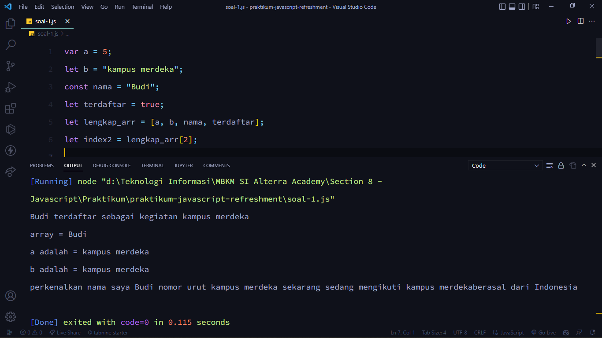
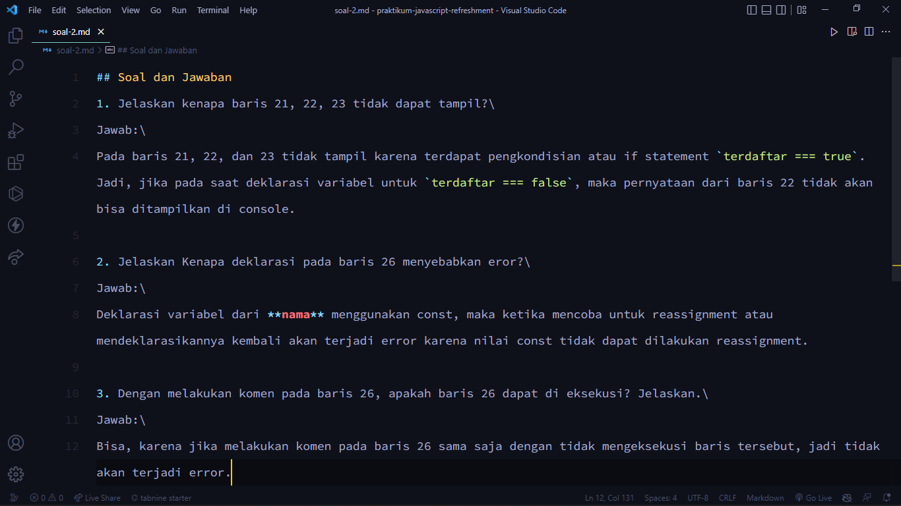
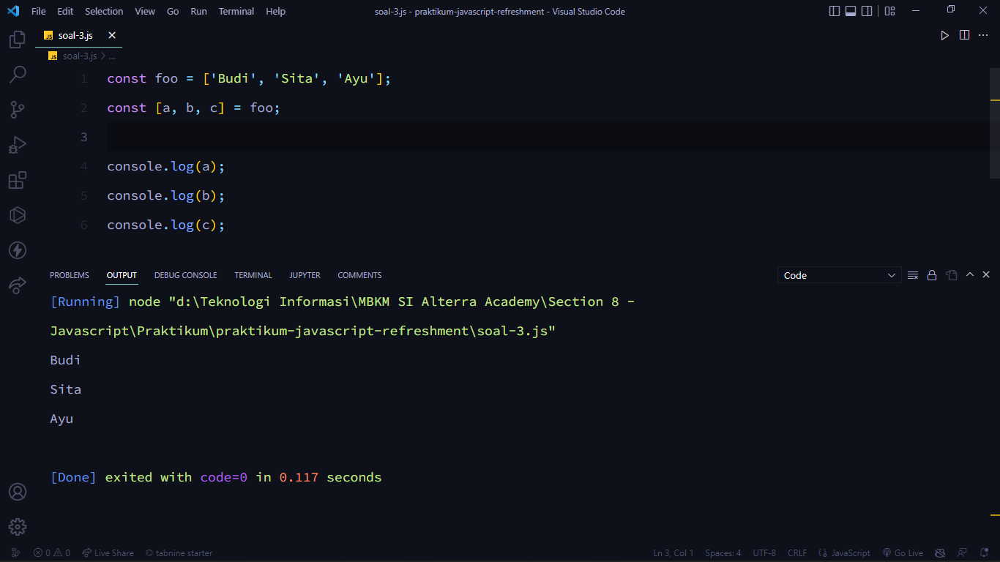
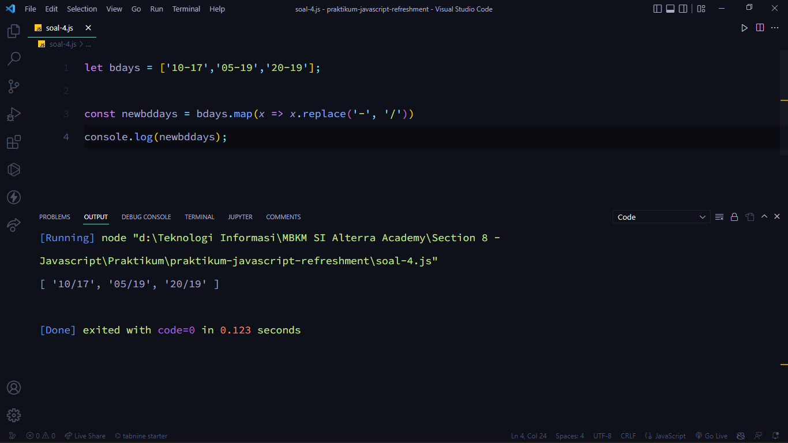
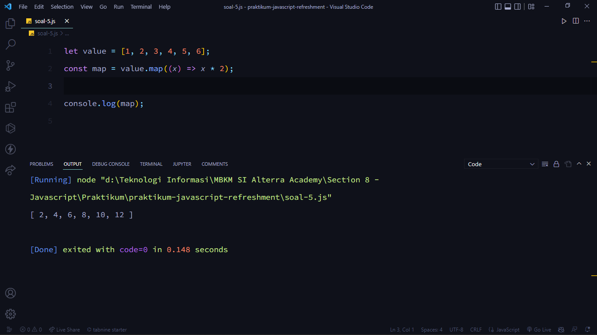
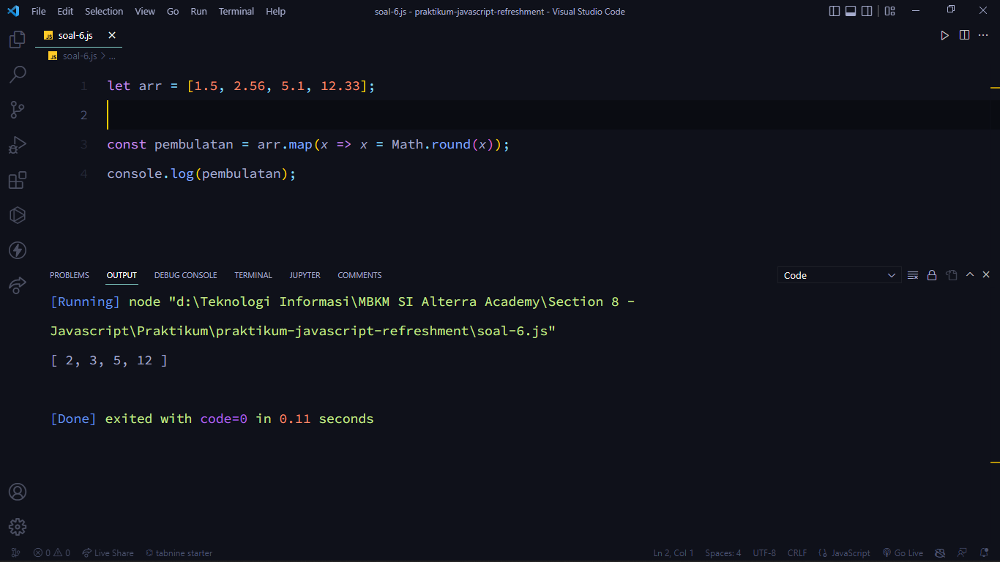

# (08) Javascript Refreshment

## Resume

Point yang dipelajari adalah:

1. Tentang Javascript
2. var, let, dan const
3. Beberapa operasi dalam Javascript

### Tentang Javascript

_**Javascript**_ adalah bahasa pemrograman yang _high-level_, _scripting_, _untyped_, dan _interpreted_. _**High-level**_ berarti _javascript_ berada di kategori bahasa pemrograman tingkat tinggi karena semakin tinggi levelnya, maka bahasanya akan semakin di mengerti oleh manusia. Lalu, _**Scripting**_ berarti _javascript_ merupakan bahasa _script_ karena _javascript_ dibuat untuk berinteraksi dengan halaman _web_ pada _browser_ seperti _Google Chrome, Microsoft Edge, Mozilla Firefox,_ dan lainnya. Kemudian, _**Untyped**_ berarti _javascript_ adalah bahasa pemrograman yang _untype_ karena tidak berpengaruh terhadap tipe data. Terakhir, _**Interpreted**_ berarti selama mempunyai sebuah _web browser javascript_ dapat dijalankan.

### var, let, dan const

#### Declaration

_**Declaration**_ adalah proses pembuatan variabel untuk menyimpan sebuah data. Terdapat 3 cara untuk mendeklarasikan variabel yaitu _var, let,_ dan _const_.

- `let`\
  Untuk _let_ digunakan saat membutuhkan nilai yang dapat diubah. Berikut adalah contoh dari deklarasi variabel _let_:

  ```js
  let num1;
  console.log(num1); // undefined
  ```

- `var`\
  _Var_ jarang dipakai, tetapi kegunaannya sama seperti _let_ dengan adanya beberapa perbedaan. Berikut adalah contoh dari deklarasi variabel _var_:

  ```js
  var num2;
  console.log(num2); // undefined
  ```

- `const`\
  Untuk _const_ digunakan saat membutuhkan nilai yang tidak dapat di _“re-assign”_ artinya tidak dapat memberikan nilai baru saat variabel _const_ tersebut sudah memiliki nilai. Jadi, ketika mendeklarasikan variabel _const_ harus memberikan nilai pada variabel tersebut terlebih dahulu agar tidak terjadi _error_. Berikut adalah contoh dari deklarasi variabel _const_:

  ```js
  const num3;
  console.log(num3); // 'const' declarations mus be initialized
  ```

#### Redeclaration

Artinya mendeklarasikan kembali varibel dengan nama yang sama.

- `var`\
  Untuk _var_ dapat melakukan _redeclaration_. Berikut adalah contoh dari _redeclaration_ dari _var_:

  ```js
  var num1;
  var num1;

  console.log(num1); // undefined
  ```

- `let`\
  Untuk _let_ tidak dapat melakukan _redeclaration_. Berikut adalah contoh dari _redeclaration_ dari _let_:

  ```js
  let num2;
  let num2;

  console.log(num2); // cannot redeclare block-scoped variable 'num2'
  ```

- `const`\
  Untuk const tidak dapat melakukan _redeclaration_. Berikut adalah contoh dari _redeclaration_ dari _const_:

  ```js
  const num3 = 1;
  const num3 = 1;

  console.log(num3); // cannot redeclare block-scoped variable 'num3'
  ```

#### Reassignment

Artinya memberikan nilai baru pada varibel yang sudah ada nilai sebelumnya.

- `var`\
  Untuk _var_ dapat melakukan _reassignment_. Berikut adalah contoh dari _reassignment_ dari _var_:

  ```js
  var num1 = 20;
  console.log(num1); // 20

  num1 = 30;
  console.log(num1); // 30
  ```

- `let`\
  Untuk _let_ dapat melakukan _reassignment_. Berikut adalah contoh dari _reassignment_ dari _let_:

  ```js
  let num2 = 20;
  console.log(num2); // 20

  num2 = 30;
  console.log(num2); // 30
  ```

- `const`\
  Untuk const tidak dapat melakukan _reassignment_. Berikut adalah contoh dari _reassignment_ dari _const_:

  ```js
  const num3 = 20;
  console.log(num3); // 20

  num3 = 30;
  console.log(num3); // Assignment to constant variable.
  ```

#### Scoping

Menentukan dimana variabel, _function_, dan objek diatur dan dapat diakses dalam _source code_, maka ruang lingkup variabel dikendalikan oleh lokasi deklarasi varibel artinya variabel, _function_, dan objek hanya dapat diakses pada ruang lingkup tertentu yang sesuai dengan deklarasi lokasi varibel tersebut. Ada tiga macam _scoping_ yaitu sebagai berikut:

- Global scope\
  Saat mendeklarasikan variabel, variabel tersebut dapat diakses untuk setiap kondisi, seperti di dalam _function_ atau _block scope_. Berikut adalah contoh dari _global scope_:

  ```js
  var nane = "Bani";
  let age = 23;
  const isMarried = true;
  ```

- Function scope\
  Saat mendeklarasikan variabel di dalam _function_, variabel tersebut tidak dapat diakses saat diluar _function_ tersebut. Berikut adalah contoh dari _function scope_:

  ```js
  function countAverage() {
  	var num1 = 7;
  	let num2 = 8;
  	const num3 = 9;
  }
  console.log(num1); // num1 is not defined
  console.log(num2); // num2 is not defined
  console.log(num3); // num3 is not defined
  ```

- Block scope\
  Berkaitan dengan tanda kurung kurawal _**{}**_, maka yang terdapat di dalam tanda tersebut merupakan _block scope_. Saat mendeklarasikan varibel, variabel yang dapat diakses hanya variavel _var_ saja, selain variabel tersebut tidak dapat diakses di luar _block scope_. Berikut adalah contoh dari _block scope_:

  ```js
  if (true) {
  	var num1 = 7;
  	let num2 = 8;
  	const num3 = 9;
  	num4 = num1 + num2 + num3;
  }
  console.log(num1); // 7
  console.log(num2); // num2 is not defined
  console.log(num3); // num3 is not defined
  console.log(num4); // 24
  ```

#### Hoisting

Membuat beberapa jenis variabel atau _function_ dapat diakses atau digunakan dalam _source code_ sebelum di deklarasikan. Deklarasi var dan function adalah hoisted, maka dapat digunakan bahkan sebelum deklarasi tersebut terjadi. Sedangkan let dan const tidak hoisted, maka tidak dapat digunakan sebelum deklarasi terjadi.

#### Tabel Kesimpulan

|       | Declaration | Redeclaration | Reassignment | Hoisting | Global Scope | Function Scope | Block Scope |
| ----- | ----------- | ------------- | ------------ | -------- | ------------ | -------------- | ----------- |
| var   | &check;     | &check;       | &check;      | &check;  | &check;      | &cross;        | &check;     |
| let   | &check;     | &cross;       | &check;      | &cross;  | &cross;      | &cross;        | &cross;     |
| const | &cross;     | &cross;       | &cross;      | &cross;  | &cross;      | &cross;        | &cross;     |

### Beberapa operasi dalam Javascript

#### Value dan References

##### Value

Dalam _**values**_ memiliki arutan sederhana untuk meneruskan nilai yaitu bahwa semua nilai _primitive_ dalam _javascript_ diteruskan oleh nilai. Berikut adalah contoh dari _value_:

```js
const one = 1;
const oneCopy = one;

console.log(one === oneCopy); // true
console.log(oneCopy === 1); // true
console.log(one === one); // true
```

##### References

Pada _**references**_, jika meneruskan _references_ akan memberikan _references_ yang sama. Berikut adalah contoh dari _references_:

```js
const ar1 = [1];
const ar2 = [1];

console.log(ar1 === ar2); // false
console.log(ar1 === [1]); // false

const ar3 = ar1;

console.log(ar1 === ar3); // true
console.log(ar1 === ar1); // true
```

_Javascript_ memiliki dua kategori tipe data yaitu _**primitive**_ dan _**objects**_ atau _**non-primitif**_.

- Primitive\
  _**Primitif**_ adalah unit pemrosesan terkecil dan elemen paling sederhana yang tersedia dalam bahasa pemrograman. Beberapa contoh dari kategori tipe data _primitive_ yaitu _string, boolean, number, bigint, undefined, null,_ dan _symbol_.
- Objects atau Non-Primitif\
  _**Objects**_ atau _**non-primitif**_ adalah unit yang menyimpan properti dan _function_. Beberapa contoh dari kategori tipe data _objects_ atau _non-primitif_ yaitu _object, array, function, date, set, map, weak set,_ dan _weak map_.

#### Destructing

_**Destructing**_ adalah ekspresi dari _javascript_ yang memungkinkan untuk menyalin nilai dari _array_ atau properti dari _object_ ke dalam variabel yang berbeda.

- Array\
  Menyalin elemen-elemen _array_ ke dalam variabel baru. Berikut adalah contoh dari _destructing array_:

  ```js
  let a = 1;
  let b = 2;
  [a, b] = [b, a];
  console.log(a); // 2
  console.log(b); // 1
  ```

- Object
  Menyalin properti dari _object_ ke dalam suatu variabel. Berikut adalah contoh dari _destructing object_:

  ```js
  const user = {
  	FIRSTNAME: "Bima",
  	LASTNAME: "Hayu Nugraha",
  };

  const { FIRSTNAME, LASTNAME } = user;
  console.log(FIRSTNAME); // Bima
  console.log(LASTNAME); // Hayu Nugraha
  ```

#### Spread

_**Spread syntax**_ dapat digunakan ketika semua elemen dari _array_ atau _object_ perlu dimasukkan ke dalam semacam daftar.

- Berikut adalah contoh dari _spread array_:

  ```js
  let a = [1, 2, 3];
  let b = [...a];
  console.log(b); // [1, 2, 3]
  console.log(a === b); // false
  ```

- Berikut adalah contoh dari _spread object_:

  ```js
  const a = { firstname: "Bima", lastname: "Hayu Nugraha" };
  const b = { ...a };
  console.log(b); // { firstname: 'Bima', lastname: 'Hayu Nugraha' }
  ```

#### Method

_**Method**_ merupakan sebuah fungsi yang terkait dengan _object_ dan membuat programnya se-sederhana mungkin sesuai kegunaannya masing-masing. Berikut adalah beberapa _method_ yang ada di _javascript_:

1. **Concat**\
   Menggabungkan dua atau lebih _array_ dan mengembalikan salinan _array_ yang digabungkan. Berikut adalah contoh dari _concat_:

   ```js
   const arr1 = ["a", "b", "c", "d", "e"];
   const arr2 = ["f", "g", "h", "i", "j"];
   const arr3 = arr1.concat(arr2);

   console.log(arr3); // ['a', 'b', 'c', 'd', 'e', 'f', 'g', 'h', 'i', 'j']
   ```

2. **Map**\
   Membuat _array_ baru dengan hasil memanggil fungsi untuk setiap elemen _array_. Berikut adalah contoh dari _map_:

   ```js
   const arr = [2, 4, 6, 8, 10];
   const map = arr.map((x) => x * 2);

   console.log(map); // [ 4, 8, 12, 16, 20 ]
   ```

3. **Foreach**\
   Memanggil fungsi untuk setiap elemen _array_. Berikut adalah contoh dari _foreach_:

   ```js
   const arr = ["a", "b", "c", "d", "e"];
   arr.forEach((x) => console.log(x));
   // Output
   // a
   // b
   // c
   // s
   // e
   ```

4. **Slice**\
   Memilih bagian dari _array_ dan mengembalikan _array_ baru. Berikut adalah contoh dari _slice_:

   ```js
   const animals = ["goat", "cat", "horse", "fish", "chicken"];
   console.log(animals.slice(3)); // [ 'fish', 'chicken' ]
   ```

5. **Filter**\
   Membuat _array_ baru dengan setiap elemen dalam array yang telah lulus seleksi. Berikut adalah contoh dari _filter_:

   ```js
   const numbers = [1, 2, 3, 4, 5, 6, 7, 8];
   const result = numbers.filter((x) => x > 4);
   console.log(result); // [ 5, 6, 7, 8 ]
   ```

6. **Reduce**\
   Melakukan operasi pada setiap elemen _array_ menjadi nilai tunggal dimulai dari kiri ke kanan. Berikut adalah contoh dari _reduce_:

   ```js
   const arr = [1, 2, 3];
   const reducer = (x, y) => x + y;
   console.log(arr.reduce(reducer)); // 6
   ```

#### Control Flow

Mengatur alur eksekusi pada _statement_ atau jalannya program sesuai dengan keinginan. Berikut adalah dua jenis _control flow_ yaitu:

1. Pengulangan (_Loop_ atau iterasi)\
   Mengatur berapa kali dalam melakukan eksekusi _statement_. Pengulangan terdiri dari:
   - For
   - White
   - Do...While
2. Pengkondisian (_if_ atau percabangan)\
   Mengatur dalam menentukan pilihan _statement_. Pengkondisian terdiri dari:

   - If..else
   - Switch
   - Block
   - Try..catch\
     _**Try**_ bertugas untuk mengeksekusi statement di dalamnya karena terdapat _block_, sedangkan _**catch**_ bertugas menangkap _error_ yang terjadi pada statement _try_. Berikut adalah contoh dari _try..catch_:

     ```js
     try {
     	NotFound();
     } catch (err) {
     	console.error(err);
     }
     ```

   - Break
   - Continue
   - Throw
     _**Throw**_ terjadi di dalam _block try_ yang bertugas untuk melemparkan _error_ sesuai dengan kondisikan yang diinginkan, kemudian _error_ tersebut akan ditangkap oleh catch. Berikut adalah contoh dari _throw_:

     ```js
     function percobaan(angka) {
     	if (angka * 0 !== 0) {
     		throw new Error("Bukan angka!");
     	}
     	return "Ini adalah angka";
     }

     try {
     	console.log(percobaan("Aku"));
     } catch (err) {
     	console.error(err); // Error: Bukan angka!
     }
     ```

#### Function

_**Function**_ adalah sebuah objek karena memiliki properti dan _method_ yang digunakan untuk melakukan serangkaian komputasi atau prosedur yang dapat digunakan berulang-ulang. Terdapat tiga cara dalam melakukan deklarasi _function_ yaitu:

1. Deklarasi Fungsi

   ```js
   function namaLengkap(depan, belakang) {
   	console.log(depan + " " + belakang); // Hedy Yanto
   }

   namaLengkap("Hedy", "Yanto");
   ```

2. Function Expression\
   Dapat membuat _function_ menjadi sebuah variabel. Berikut adalah contoh dari _function expression_:

   ```js
   let awalan = function (sambutan) {
   	console.log(sambutan); // Hello semuanya
   };

   awalan("Hello semuanya");
   ```

3. Arrow Function\
   Membuat _function_ menjadi lebih ringkas dengan menggunakan tanda **(=>)**. Berikut adalah contoh dari _arrow function_:

   ```js
   let biodata = (nama, asal, hobi) => {
   	console.log("Nama Saya " + nama + " berasal dari " + asal + " mempunyai hobi " + hobi); // Nama Saya Bima berasal dari Jawa Timur mempunyai hobi Naik Gunung
   };

   biodata("Bima", "Jawa Timur", "Naik Gunung");
   ```

#### Classes

Di dalam _**classes**_ terdapat:

1. Class \
   _**Class\***_ adalah _prototype_ dari suatu _object_ yang akan dibuat.
2. Constructor\
   _**Constructor**_ adalah _method_ di dalam _class_ yang akan selalu terpanggil pertama kali ketika akan membuat _object_.
3. Method\
   _\*\*Method_ adalah sebuah fungsi yang berada di dalam _class_.
4. Attributes\
   _**Attributes**_ adalah kumpulan variabel yang membentuk _object_ yang dimiliki oleh suatu _class_.
5. Extends\
   Digunakan untuk membuat _class child_ dari _class parent_. _Class child_ mewarisi semua _attribut_ dan method dari _class parent_.

Berikut adalah contoh dari _classes_:

```js
// Class Child
class Kamu {
	// Constructor
	constructor(nama, asal) {
		this.nama = nama;
		this.asal = asal;
	}
	// Method
	perkenalan() {
		return `Saya ${this.nama}, asal ${this.asal}`;
	}
}

// Class Parent
class Aku extends Kamu {
	// Constructor
	constructor(nama, asal, mitra) {
		super(nama, asal);
		this.mitra = mitra;
	}
	// Method
	perkenalan() {
		return `Saya ${this.nama}, asal ${this.asal}. Saya belajar di Mitra ${this.mitra}`;
	}
}

const kamu = new Kamu("Nugraha", "Yogyakarta");
const aku = new Aku("Bima", "Magetan", "Alterra Academy");

console.log(kamu.perkenalan()); // Saya Nugraha, asal Yogyakarta
console.log(aku.perkenalan()); // Saya Bima, asal Magetan. Saya belajar di Mitra Alterra Academy
```

#### Async – Await

Dalam _**Async – await**_ terdapat:

1. **Synchronous**\
   Mengeksekusi setiap perintah satu persatu sesuai dengan urutan kode yang dituliskan. Berikut adalah contoh dari _synchronous_:

   ```js
   console.log("Mulai");
   console.log("Proses...");
   console.log("Berhenti");

   // Output
   // Mulai
   // Proses...
   // Berhenti
   ```

2. **Asynchronous**\
   Hasil eksekusi atau _output_ tidak selalu berdasarkan urutan kode, tetapi berdasarkan waktu proses. Berikut adalah contoh dari _asynchronous_:

   ```js
   console.log("Mulai");
   setTimeout(() => {
   	console.log("Proses...");
   }, 1000);
   console.log("Berhenti");

   // Output
   // Mulai
   // Berhenti
   // Proses...
   ```

3. **Callback**\
   Fungsi yang dikirimkan sebagai parameter pada fungsi lain atau fungsi yang dieksekusi setelah fungsi lain selesai dijalankan. Berikut adakah contoh dari _callbak_:

   ```js
   function cekLuas(panjang, lebar) {
   	return panjang * lebar;
   }
   function cekUkuran(angka1, angka2, callback) {
   	let luas = callback(angka1, angka2);
   	if (luas >= 100) {
   		return "Besar";
   	} else {
   		return "Kecil";
   	}
   }
   console.log(cekUkuran(10, 10, cekLuas)); // Besar
   ```

4. **Promise**\
   Objek yang mempresentasikan keberhasilan atau kegagalan pada sebuah _event_ yang _asynchronous_ dimasa mendatang. Berikut adalah beberapa dari _promise_:

   - _Resolve_ (Promsie terpenuhi) -> menjalankan aksi `.Then()`
   - _Reject_ (Promise tidak terpenuhi) -> menjalankan aksi `.Catch()`
   - _Finally_ (Promise proses selesai dan bersifat optional)

   Berikut adalah contoh dari _promise_:

   ```js
   let aktif = true;
   const test1 = new Promise((resolve, reject) => {
   	if (aktif) {
   		setTimeout(() => {
   			resolve("Status Aktif!");
   		}, 2000);
   	} else {
   		setTimeout(() => {
   			reject("Status Tidak Aktif!");
   		}, 2000);
   	}
   });

   console.log("Mulai");
   test1
   	.finally(() => console.log("Proses Selesai"))
   	.then((response) => console.log(response))
   	.catch((response) => console.log(response));
   console.log("Selesai");

   // Mulai
   // Selesai
   // Proses Selesai
   // Status Aktif!
   ```

5. **Asynchronous function**\
   Sebuah function yang bekerja secara _asynchronous_ yang menghasilkan _promise_ sebagai _return value_ nya, tetapi cara penulisan code menggunakan penulisan yang _synchronous_ atau standar.

6. **Await**\
   Sebuah _keyword_ yang terdapat pada _async function_ yang tujuannya menghentikan eksekusi sambil menunggu _promise_ selesai. Berikut adalah contoh dari _await_:

   ```js
   function test2() {
   	return new Promise((resolve, reject) => {
   		let aktif = true;
   		if (aktif) {
   			setTimeout(() => {
   				resolve("Status Aktif");
   			}, 2000);
   		} else {
   			setTimeout(() => {
   				reject("Status Tidak Aktif");
   			}, 2000);
   		}
   	});
   }

   async function testing() {
   	try {
   		let hasil = await test2();
   		console.log(hasil);
   	} catch (err) {
   		console.error(err);
   	}
   }

   testing(); // Status Aktif
   ```

#### DOM

_**DOM (Document Object Model)**_ adalah _API_ untuk _HTML_ yang mempresentasikan halaman _web_ pada suatu dokumen menjadi sebuah _object_. Terdapat 3 jenis _DOM_ yaitu:

##### 1. DOOM Selection Method

| Event                     | Kegunaan       |
| ------------------------- | -------------- |
| `getElementById()`        | Element        |
| `getElementByTagName()`   | HTMLCollection |
| `getElementByClassName()` | HTMLCollection |
| `querySelector()`         | Element        |
| `querySelectorAll()`      | nodeList       |

##### 2. DOM Manipulation

| Event                         | Kegunaan                                                                   |
| ----------------------------- | -------------------------------------------------------------------------- |
| `element.innerHTML`           | Digunakan untuk mengubah isi dari tag yang sudah diseleksi                 |
| `element.style.<propertyCSS>` | Digunakan untuk mengubah style dari tag yang sudah diseleksi               |
| `element.setAttribute()`      | Digunakan untuk mengelola atau memanipulasi attribute yang sudah diseleksi |
| `element.classList.add()`     | Digunakan untuk mengelola atau memanipulasi class yang sudah diseleksi     |

##### 3. DOOM Event

| Event         | Kegunaan                                                     |
| ------------- | ------------------------------------------------------------ |
| `onclick`     | Digunakan ketika mengklik pada mouse                         |
| `onchange`    | Digunakan dalam kombinasi dengan validasi bidang input       |
| `onblur`      | Digunakan ketika meninggalkan kolom input                    |
| `onmouseover` | Digunakan ketika mengarahkan mouse ke atas pada suatu object |
| `onmouseout`  | Digunakan ketika mengarahkan mouse keluar pada suatu object  |
| `oncopy`      | Digunakan ketika melakukan copy suatu object                 |

Pada _DOM event_ terdapat 2 _event_ tambahan yaitu

1. Event Handler
   - Inline HTML attribute
   - Element method
2. addEventListener()

## Task

### 1. Menulis ulang kode dan menyimpan kode tersebut dengan format javascript

Pada tugas ini yaitu menuliskan ulang kode yang terdapat di soal praktikum _Section 8 - Javascript Refreshment_ dan menyimpan kode tersebut dengan format _Javascript_.

Berikut adalah _source code_ untuk soal yang pertama:

[soal-1.js](./praktikum/soal-1.js)

Berikut adalah hasil _output_ untuk soal yang pertama:



### 2. Menjawab 3 pertanyaan yang diberikan

Pada tugas ini yaitu menjawab 3 pertanyaan yang diberikan sesuai dengan materi yang dijelaskan.

Berikut adalah _source code_ untuk soal yang kedua:

[soal-2.md](./praktikum/soal-2.md)

Berikut adalah hasil _output_ untuk soal yang kedua:



### 3. Melakukan destructuring

Pada tugas ini yaitu melakukan _destructuring_ pada kode yang sudah ditentukan yaitu `const foo = ['Budi', 'Sita', 'Ayu'];`. dengan Budi tersimpan dalam variabel a, Sita tersimpan dalam variabel b, dan ayu tersimpan dalam variabel c.

Berikut adalah _source code_ untuk soal yang ketiga:

[soal-3.js](./praktikum/soal-3.js)

Berikut adalah hasil _output_ untuk soal yang ketiga:



### 4. Mengubah tanda (-) menjadi (/) pada sebuah variabel yang sudah ditentukan

Pada tugas ini yaitu mengubah tanda (-) menjadi (/) pada sebuah variabel yang sudah ditentukan yaitu `let bdays = ['10-17','05-19','20-19'];`, sehingga output yang keluar pada console adalah `[ '10/17', '05/19', '20/19' ]`.

Berikut adalah _source code_ untuk soal yang keempat:

[soal-4.js](./praktikum/soal-4.js)

Berikut adalah hasil _output_ untuk soal yang keempat:



### 5. Melakukan perkalian pada setiap value dengan perkalian dua dari variabel yang sudah ditentukan

Pada tugas ini yaitu melakukan perkalian pada setiap _value_ dengan perkalian dua dari variabel yang sudah ditentukan yaitu `let value = [1, 2, 3, 4, 5, 6];`, sehingga ketika dipanggil variabel _value_ nya akan mengeluarkan output `[ 2, 4, 6, 8, 10, 12 ]`.

Berikut adalah _source code_ untuk soal yang kelima:

[soal-5.js](./praktikum/soal-5.js)

Berikut adalah hasil _output_ untuk soal yang kelima:



### 6. Melakukan pembulatan ke atas untuk variabel yang sudah ditentukan

Pada tugas ini yaitu melakukan pembulatan ke atas untuk variabel yang sudah ditentukan yaitu `let arr = [1.5, 2.56, 5.1, 12.33];`, sehingga output yang dihasilkan adalah `[ 2, 3, 5, 12 ]`.

Berikut adalah _source code_ untuk soal yang keenam:

[soal-6.js](./praktikum/soal-6.js)

Berikut adalah hasil _output_ untuk soal yang keenam:



#### Soal pada tugas praktikum ini

Note: Klik [soal praktikum section 8 - javascript refrehment](https://docs.google.com/document/d/1Ke6H5HerrxYGt6QuDHtCCbqQwPUFcgGLoFI1a0n-6D8/edit?usp=sharing) untuk melihat soalnya.
