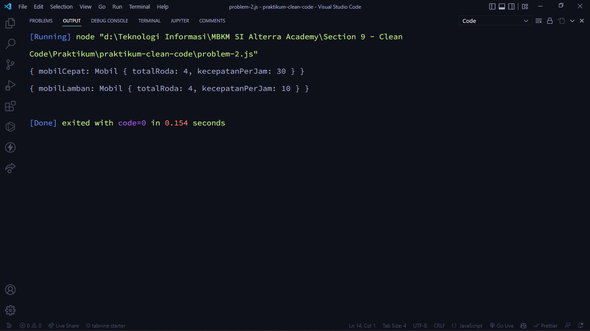

# (09) Clean Code

## Resume

Point yang dipelajari pada materi ini adalah

1. Tentang Clean Code
2. Karakteristik Clean Code
3. Prinsip Clean Code

### Tentang Clean Code

_**Clean code**_ adalah istilah untuk kode yang mudah dibaca, dipahami, dan diubah oleh _programmer_. _Clean code_ sangat dibutuhkan pada saat **bekerja secara kolaborasi** atau team karena orang yang akan berkolaborasi dengan kita harus bisa membaca apa yang dikerjakan. _Clean code_ juga dibutuhkan saat _**faster development**_ ketika membuat sebuah fitur sebenarnya fitur yang dibuat memiliki kegunaan apa dan fungsi-fungsinya bagaimana, maka _clean code_ dapat memudahkan dalam membacanya. Jika, sudah mudah dalam membaca, memahami, dan memodifikasi, maka akan _**faster development**_ atau lebih cepat dalam mempelajari dan memahaminya.

### Karakteristik Clean Code

1. Mudah dipahami
2. Mudah dieja dan dicari
3. Singkat namun mendeskripsikan konteks
4. Konsisten
5. Menghindari penambahan konteks yang tidak perlu
6. Menambahkan komentar
7. Memakai _function_ yang baik
8. Menggunakan konvensi
9. _Formatting_
   Dalam melakukan _formatting_ pada _code_, terdapat beberapa saran sebagai berikut:
   - Lebar garis pada _code_ yaitu 80 – 120 karakter.
   - Dalam satu _class_ memiliki 300 – 500 baris.
   - Baris _code_ yang berhubungan harus saling berdekatan.
   - Mendekatkan fungsi dengan pemanggilnya, artinya tidak selalu harus dalam satu _file_, dapat di dalam satu _package_ atau satu _class_. Jadi, terdapat koneksi antara pemanggil dan fungsinya.
   - Deklarasi variabel harus berdekatan dengan penggunanya.
   - Perhatikan indentasi.
   - Menggunakan _prettier_ atau _formatter_.

### Prinsip Clean Code

1. **KISS** _(Keep It So Simple)_\
   Artinya menghindari membuat fungsi yang melakukan lebih dari satu tugas. Berikut adalah tips untuk dapat selalu _KISS_: - Fungsi atau _class_ harus kecil, artinya saat membuat sebuah fungsi atau _class_ harus simpel. - Fungsi dibuat untuk melakukan hanya satu tugas saja. - Jangan menggunakan terlalu banyak argumen pada sebuah fungsi. - Harus memperhatikan untuk mencapai kondisi yang seimbang. - Kecil dan jumlahnya minimal.
2. **DRY** _(Don’t Repeat Yourself)_\
   Artinya duplikasi _code_ terjadi karena sering melakukan _copy paste_ secara terus-menerus. Untuk dapat menghindari duplikasi _code_ yaitu membuat fungsi yang dapat digunakan atau dipanggil secara berulang-ulang.
3. **Refactoring**\
   _Refactoring_ adalah proses restrukturisasi _code_ yang dibuat dengan cara mengubah struktur internal tanpa harus mengubah perilaku eksternal. Prinsip _KISS_ dan _DRY_ dapat dicapai dengan cara _refactoring_. Teknik dalam melakukan _refactoring_ adalah sebagai berikut: - Membuat sebuah abstraksi. - Memecah _code_ dengan fungsi atau _class_. - Memperbaiki penamaan dan lokasi dari _code_. - Mendeteksi _code_ yang memiliki duplikasi.

## Task

### 1. Problem 1 - Analysis

Pada tugas ini yaitu melakukan analisis dari _code_ yang dituliskan tanpa mengikuti standar penulisan yang disarankan.

Berikut untuk pertanyaan dan _code_ nya yang dilakukan analisis:

#### Pertanyaan

1. Berapa banyak kekurangan dalam penulisan kode tersebut?
2. Bagian mana saja terjadi kekurangan tersebut?
3. Tuliskan alasan dari tiap kekurangan tersebut!

#### Code yang salah dalam penulisan

```js
class user {
	var id;
	var username;
	var password;

}

class userservice {
	user[] users = [];

	user[] getallusers() {
	    return users;
	}

	user getuserbyid(userid) {
	    return users.filter(userid);
	}
}
```

Berikut adalah hasil analis untuk problem 1 - analysis:

[problem-1.md](./praktikum/problem-1.md)

### 2. Problem 2 - Rewrite

Pada tugas ini yaitu mengubah _code_ menjadi lebih terbaca dan rapi.

Berikut untuk soal _code_ nya yang dalam penulisannya masih belum mengikuti standar yang disarankan:

```js
class kendaraan {
	var totalRoda = 0;
	var kecepatanperjam = 0;
}

class mobil extends kendaraan {
	void berjalan() {
		tambahkecepatan(10);
	}

	tambahKecepatan(var kecepatanbaru) {
		kecepatanperjam = kecepatanperjam + kecepatanbaru;
	}
}

void main() {
    mobilcepat = new mobil();
    mobilcepat.berjalan();
    mobilcepat.berjalan();
    mobilcepat.berjalan();

    mobillamban = new mobil();
    mobillamban.berjalan();
}
```

Berikut adalah _source code_ untuk problem 2 - Rewrite:

[problem-2.js](./praktikum/problem-2.js)

Berikut adalah hasil _output_ untuk problem 2 - Rewrite:


