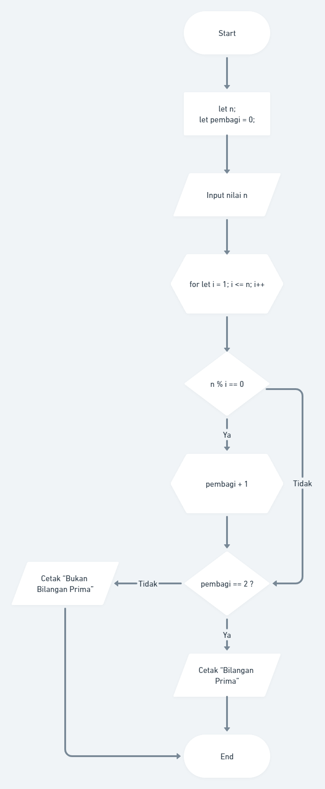
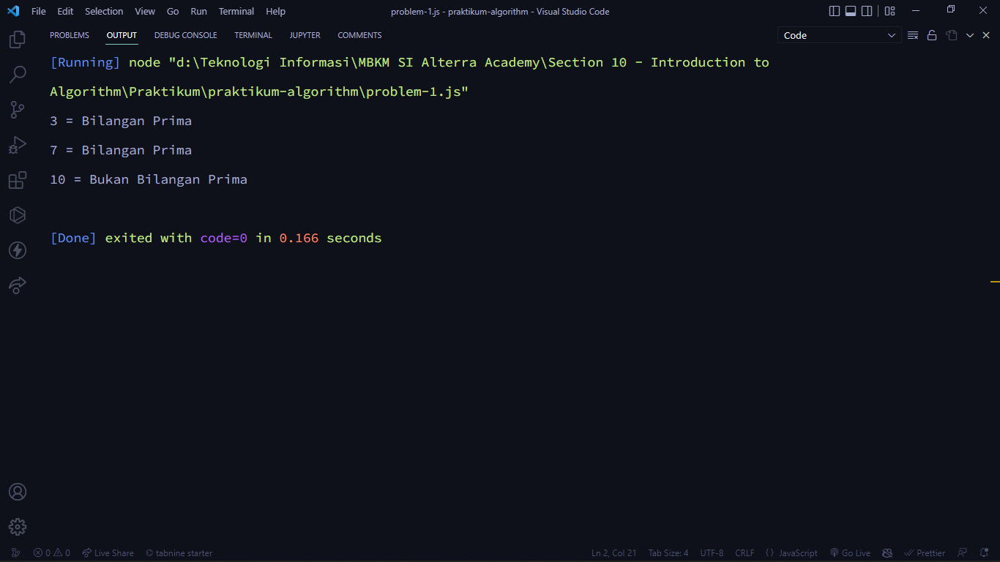
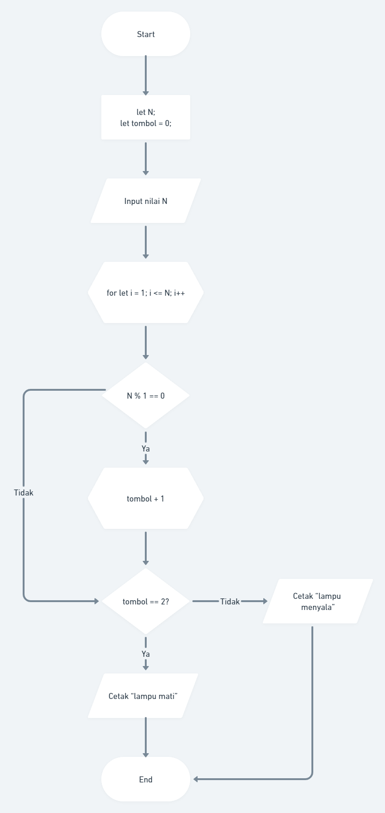
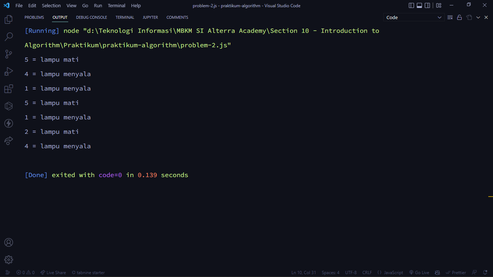

# (10) Introduction Algorithm

## Resume

Point yang dipelajari pada materi ini adalah

1. Algoritma
2. Pseudocode
3. Flowchart

### Algoritma

#### Tentang Algoritma

**Algoritma** adalah sebuah **prosedur komputasi** yang didefiniskan dengan baik yang mengambil beberapa **nilai** sebagai _**input**_ dan menghasilkan beberapa nilai sebagai _**output**_. Prosesdur komputasi maksudnya adalah instruksi yang diberikan kepada komputer agar komputer dapat memahami dan menjalankan apa yang diinginkan. Beberapa contoh dari penggunaan algoritma yaitu algoritma dapat digunakan untuk mengecek sebuah bilangan apakah bilangan tersebut bilangan prima atau tidak, mengurutkan data atau _sorting_, dan melakukan pencarian data.

#### Karakteristik Algoritma

1. Memiliki sebuah batas awal dan akhir
   Jika algoritma tidak memiliki awalan dan akhiran, maka algoritma tersebut akan _looping_ secara terus-menerus tanpa berakhir.
2. Instruksi terdefinisi dengan baik
   Algoritma harus jelas pada setiap urutan tahapannya dalam menyelesaikan masalah.
3. Efektif dan efisien
   Efektif artinya bahwa algoritma harus dapat menghasilkan _output_ yang diharapkan. Sedangkan Efisien artinya bahwa algoritma dapat menyelesaikan sebuah masalah dengan waktu yang relatif cepat.

#### Dasar Algoritma

Dalam penyusunan algoritma terdapat tiga konsep utama yaitu:

1. **Sequential**
   Urutan dalam menyusun langkah-langkah untuk menyelesaikan sebuah masalah.
2. **Branching**
   Digunakan untuk menunjukkan sebuah alur atau _flow_ dari sebuah program.
3. **Looping**
   Konsep untuk melakukan sebuah aksi secara berulang sampai dengan kondisi tertentu dapat terpenuhi.

### Pseudocode

Pseudocode adalah deskripsi bahasa sederhana yang bisa digunakan untuk menuangkan sebuah ide algoritma.

### Flowchart

#### Pengertian flowchart

_**Flowchart**_ adalah suatu bagan dengan simbol tertentu yang menggambarkan urutan dan hubungan antar proses secara detail. _Flowchart_ digunakan untuk merepresentasikan sebuah algoritma dalam menyelesaikan sebuah persoalan atau program tertentu.

#### Simbol flowchart

Untuk dapat menggambarkan sebuah _flowchart_ terdapat berbagai macam simbol yang bisa digunakan dan masing-masing memiliki fungsi. Berikut adalah beberapa simbol _flowchart_:

| Simbol          | Kegunaan                                                          |
| --------------- | ----------------------------------------------------------------- |
| Kapsul          | Digunakan untuk merepresentasikan proses mulai atau selesai       |
| Persegi Panjang | Digunakan untuk merepresentasikan sebuah proses atau kalkulasi    |
| Jajar Genjang   | Digunakan untuk merepresentasikan input atau output               |
| Diamond         | Digunakan untuk merepresentasikan kondisi atau brancing           |
| Persegi Enam    | Digunakan untuk merepresentasikan proses pengulangan atau looping |

## Task

### Problem 1 - Bilangan Prima

Pada tugas ini yaitu membuat flowchart dan algoritma untuk menentukan bahwa sebuah bilangan termasuk bilangan prima atau tidak.

Berikut untuk soal praktikumnya yang lebih lengkap:

Dalam matematika, bilangan prima adalah bilangan asli yang lebih besar dari angka 1, yang faktor pembaginya adalah 1 dan bilangan itu sendiri. 2 dan 3 adalah bilangan prima. 4 bukan bilangan prima karena 4 bisa dibagi 2. Kamu diminta untuk membuat fungsi untuk menentukan bahwa sebuah bilangan termasuk bilangan prima atau tidak.

**Buatlah flowchart untuk menentukan bilangan prima menggunakan https://whimsical.com!**

**Sample Test Cases**\
Input: 3\
Output: Bilangan Prima

Input: 7\
Output: Bilangan Prima

Input: 10\
Output: Bukan Bilangan Prima

Berikut adalah hasil _flowchart_ untuk problem 1 - bilangan prima:

Berikut adalah _source code_ untuk problem 1 - bilangan prima:

[problem-1.js](./praktikum/problem-1.js)

Berikut adalah hasil _output_ untuk problem 1 - bilangan prima:

### Problem 2 - Lampu dan Tombol

Pada tugas ini yaitu membuat flowchart dan algoritma untuk membuat tombol ketika ditekan akan membuat sebuah lamput mati atau menyala.

Berikut untuk soal praktikumnya yang lebih lengkap:

Terdapat N tombol yang dinomori dari 1 hingga N dan sebuah lampu dalam keadaan mati. Apabila tombol ke-i ditekan, keadaan lampu akan berubah (dari mati menjadi menyala, atau sebaliknya) jika N habis dibagi oleh i. Apabila masing-masing tombol ditekan tepat sekali,
bagaimana keadaan lampu pada akhirnya?

**Format Masukan**\
Sebuah baris berisi sebuah bilangan, yaitu N.

**Sebuah baris berisi sebuah bilangan, yaitu N. Format Keluaran Sebuah baris berisi:**\
• "lampu mati", apabila keadaan akhir lampu adalah mati.\
• "lampu menyala", apabila keadaan akhir lampu adalah menyala.

**Buatlah flowchart untuk algoritma tersebut menggunakan https://whimsical.com!**

Contoh Masukan\
5\
Contoh Keluaran\
lampu mati

Contoh Masukan\
4\
Contoh Keluaran\
lampu menyala

**Penjelasan**\
Pada contoh pertama, tombol yang mempengaruhi keadaan lampu adalah tombol 1 dan tombol 5. Penekanan tombol 1 mengakibatkan lampu menjadi menyala, dan penekanan tombol 5 mengembalikannya ke keadaan mati.

Pada contoh kedua, tombol yang mempengaruhi keadaan lampu adalah tombol 1, tombol 2, dan tombol 4. Penekanan tombol 1 mengakibatkan lampu menjadi menyala, penekanan tombol 2 mengembalikannya ke keadaan mati, dan penekanan tombol 4 menjadikan lampu kembali menyala.

Berikut adalah hasil _flowchart_ untuk problem 2 - lampu dan tombol:

Berikut adalah _source code_ untuk problem 2 - lampu dan tombol:

[problem-2.js](./praktikum/problem-2.js)

Berikut adalah hasil _output_ untuk problem 2 - lampu dan tombol:

