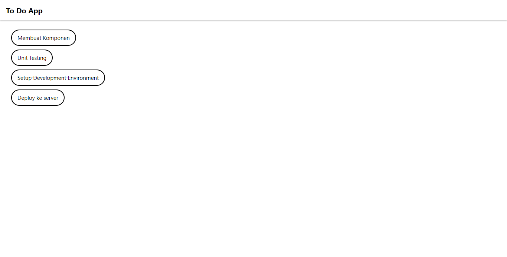

# (12) React Fundamental

## Resume

Point yang dipelajari adalah:

1. JSX pada React
2. Konsep Utama Dalam React
3. Directory Structure dan Styling Inline pada React

### JSX pada React

#### Apa itu JSX?

_**JSX**_ adalah singkatan dari _Javascript XML_ yang merupakan ekstensi _syntax_ pada _Javascript_ yang dalam penggunaannya lebih disarankan di _React_ karena lebih menggambarkan apa yang seharusnya tampak pada _UI_. Berikut adalah contoh dari _JSX_:

```js
const element = <h1>Hello, world!</h1>;
```

#### Kenapa menggunakan JSX?

_JSX_ dibuat berdasarkan fakta bahwa logika _rendering_ sangat terikat dengan logika _UI_. Dengan menggunakan _React_ dapat menggabungkan teknologi (_separation of technology_) dan memisahkan sesuai dengan kepentingannya (_separation of concerns_) dengan unit yang paling rendah atau komponen. Dengan menggunakan _JSX_ dapat menggabungkan _HTML, CSS_, dan _JS_ dalam satu _file_.

#### JSX vs React.createElement

Kita tidak perlu menggunakan _JSX_, tetapi _JSX_ dapat memudahkan dalam menulis sebuah aplikasi _React_. Pada dasarnya _JSX_ menyediakan sintaksis-sinstaksis yang mudah ditulis dan dipahami atau yang disebut dengan _Syntactic Sugar_ untuk fungsi `React.createElement`. Berikut adalah contoh perbandingan dari penggunaan _JSX_ dan `React.createElement`:

1. **JSX**

   ```js
   <MyButton color="blue" shadowSize={2}>
   	Klik saya
   </MyButton>
   ```

2. `React.createElement`
   ```js
   React.createElement(MyButton, { color: "blue", shadowSize: 2 }, "Klik saya");
   ```

#### Spesifikasi jenis pada Elemen React

Jenis elemen pada _React_ dibagi menjadi dua yaitu:

1. Kapitalisasi untuk komponen _React_.\
   Berikut adalah contohnya:

   ```js
   <MyButton color="blue" shadowSize={2}>
   	Klik saya
   </MyButton>
   ```

2. Huruf kecil (lowercase) untuk komponen bawaan.\
   Berikut adalah contohnya:
   ```js
   <h1>Hello, world!</h1>
   ```

Berikut contoh dari spefisikasi jenis pada elemen _React_:

```js
import React from "react";

function Hello(props) {
	return <div>Hello {props.toWhat}</div>;
}

function HelloWorld() {
	return <Hello toWhat="World" />;
}
```

#### Menaruh expression pada JSX

Kita dapat menaruh ekspresi _JS_ yang valid pada _JSX_ dengan menggunakan kurung kurawal **{}**. Berikut adalah contohnya:

```js
function formatName(user) {
	return user.firstName + " " + user.lastName;
}

const user = {
	firstName: "Harper",
	lastName: "Perez",
};

const element = <h1>Hello, {formatName(user)}!</h1>;

ReactDOM.render(element, document.createElement("root"));
```

#### JSX adalah expression

Setelah dikompilasi, ekspresi _JSX_ akan menjadi panggilan fungsi _Javascript_ biasa dan menjadi objek _Javascript_. Berikut adalah contohnya:

```js
function getGreeting(user) {
	if (user) {
		return <h1>Halo, {formateName(user)}!</h1>;
	}
	return <h1>Halo, Orang Asing.</h1>;
}
```

#### Menentukan atribut dengan menggunakan JSX

1. Untuk menentukan string literal menggunakan tanda kutip **“”**.\
   Berikut adalah contohnya:

   ```js
   const element = <div tabIndex="0"></div>;
   ```

2. Untuk menyematkan ekpresi _Javascript_ menggunakan kurung kurawal **{}**.\
   Berikut adalah contohnya:

   ```js
   const element = </img>;
   ```

3. _React DOM_ mengunakan _camelCase_ sebagai konvensi penamaan.\
   Berikut adalah contohnya:
   ```js
   // Valid
   <button onClick={handleClick} className="myButton">Click Me</button>
   // Tidak Valid
   <button onclick={handleClick} class="myButton">Click Me</button>
   ```

#### Menspesifikasikan elemen Child dengan JSX

1. Jika _tag_ bersifat kosong (tidak memiliki elemen _child_), maka dapat menutupnya secara langsung menggunakan **/>**.\
   Berikut adalah contohnya:

   ```js
   const element = ;
   ```

2. _Tag JSX_ dimungkinkan untuk memiliki elemen _child_.\
   Berikut adalah contohnya:
   ```js
   const element = (
   	<div>
   		<h1>Halo!</h1>
   		<h2>Senang melihatmu di sini.</h2>
   	</div>
   );
   ```

### Konsep Utama Dalam React

#### React Component

##### Apa itu Component?

_**React component**_ adalah bagian kode yang dapat digunakan kembali untuk menentukan tampilan, _behavior_, dan _state_ dari sebagian _UI_. Komponen ini dapat mempermudah untuk memecah _UI_ menjadi bagian tersendiri, dimana bagian tersebut dapat digunakan kembali dan untuk setiap potongan komponen itu dalam sebuah isolasi. Dalam komponen dapat menerima props, lalu di dalamnya terdapat _state_ atau data yang di isolasi pada komponen tersebut dan dari komponen nanti akan di _render_ menjadi _DOM_.

##### Membagi bagian _UI_ menjadi beberapa Component

Untuk membagi _UI_ menjadi sebuah hierarki komponen pada sebuah _React_ langkah pertama yang dapat dilakukan adalah dengan menggambarkan kotak-kotak untuk setiap komponen dan sub komponen yang ada pada _Mock Up UI_ yang dipunyai dan memberikan masing-masing nama untuk setiap komponennya.

##### Function dan Class Component

Untuk membuat komponen pada _React_ terdapat dua cara yaitu:

1. Menggunakan _function_ biasa pada _Javascript_.\
   Berikut untuk contohnya:

   ```js
   function Welcome() {
   	return <h1>Hello, Dunia!</h1>;
   }
   ```

2. Menggunakan _class_ yang harus _extends_ pada `React.Component`.\
   Berikut untuk contohnya:

   ```js
   class Welcome extends React.Component {
   	render() {
   		return <h1>Hello, Dunia!</h1>;
   	}
   }
   ```

##### Membuat dan merender componen Pada React

```js
function Welcome() {
	return <h1>Halo Teman2</h1>;
}

const element = <Welcome />;
ReactDOM.render(element, document.getElementById("root"));
```

#### Component Composition & props

##### Apa itu props?

1. _**Props**_ adalah singkatan dari _properties_ yang membuat dapat memberikan argumen atau data pada komponen. Nantinya _parent_ komponen dapat melakukan open informasi atau data tadi pada _children_ komponen menggunakan _props_ dan _props_ dapat berupa _array, object, number, function, React element,_ dan lainnya.
2. _**Props**_ membantu untuk membuat komponen menjadi lebih dinamis.
3. _**Props**_ dioper ke komponen sama seperti memberikan _attribut_ pada _tag HTML_.
4. _**Props**_ pada komponen adalah _read-only_ dan tidak dapat diubah. Jadi, _child_ komponen tidak dapat mengubah _props_ yang dikirim oleh _parent_ komponen.

##### One way data flow pada React

Secara umum, konsep ini berarti data hanya mempunyai satu dan hanya satu cara untuk ditransfer ke bagian lain dari sebuah aplikasi, artinya dari sebuah _parent_ komponen yang merupakan komponen dengan hirarki tertinggi dapat mentransfer data melalui _props_ ke _child_ komponen atau komponen yang hirarkinya di bawahnya, tetapi tidak sebaliknya yaitu sebuah _child_ komponen di dapat mengoper _props_ ke _parent_ komponen.

##### Komposisi komponen pada React

_React_ memiliki model atau gaya komposisi yang cukup powerfull dan sangat merekomendasikan penggunaan komposisi untuk menggunakan kembali _code_ antar komponen. Terdapat dua tipe komposisi yaitu:

1. Kontainmen\
   Pada komposisi menggunakan kontainmen beberapa komponen tidak serta-merta mengetahui _child_ komponen ketika didefinisikan. Berikut adalah contoh dari komposisi kontainmen:

   ```js
   function FancyBorder(props) {
   	return <div className={"FancyBorder FancyBorder-" + props.color}>{props.children}</div>;
   }

   function WelcomeDialog() {
   	return (
   		<FancyBorder color="blue">
   			<h1 className="Dialog-title">Selamat Datang</h1>
   			<p className="Dialog-message">Terima kasih telah mengunjungi pesawat luar angkasa kami!</p>
   		</FancyBorder>
   	);
   }
   ```

2. Spesialisasi\
   Terkadang menganggap beberapa komponen sebagai kasus spesial dari komponen lainnya. Berikut adalah contoh dari komposisi spesialisasi:

   ```js
   function SplitPane(props) {
   	return (
   		<div className="SplitPane">
   			<div className="SplitPane-left">{props.left}</div>
   			<div className="SplitPane-right">{props.right}</div>
   		</div>
   	);
   }

   function App() {
   	return <SplitPane left={<Contacts />} right={<Chat />} />;
   }
   ```

#### React Lifecycle

_**React lifecycle**_ adalah sederetan _event_ yang terjadi dari awal komponen muncul sampai komponen tersebut menghilang dari sebuah aplikasi. Siklus pada komponen _React_ dibagi menjadi tiga yaitu:

1. Lahir (_Mounting_)\
   Hanya dapat terjadi 1 kali.
2. Tumbuh (_Updating_)\
   Bisa terjadi berkali-kali yaitu terjadi ketika ada _props_ baru atau perubahan _props_, _state_ baru, dan ketika melakukan _update_ secara manual menggunakan _force update_.
3. Mati (_Unmounting_)\
   Hanya dapat terjadi 1 kali.

Secara umum siklus-siklus ini dibagi menjadi tiga fase yaitu:

1. Render Phase\
   Pada fase ini fungsinya harus _pure_ dan tidak boleh ada _side affects_. _Side affects_ adalah seperti melakukan perubahan _state_ pada kom[onen].
2. Pre-commit Phase\
   Pada fase ini dapat membaca _DOM_.
3. Commit Phase\
   Pada fase ini dapat melakukan pengolahan _DOM_ dan _side affects_ seperti perubahan _state_.

Beberapa _lifecycle method_ yang umum atau sering dipakai adalah sebagai berikut:

1. `render()`\
   `render()` adalah _lifecycle method_ yang paling sering dipakai. Pada komponen menggunakan _class_ fungsi `render()` menjadi _mandatory_, sehingga ketika membuat komponen _class_ tanpa _method_ `render()`, komponen dapat _error_. Pada `render()` juga harus menggunakan _pure function_, jadi tidak boleh terdapat _side affects_ seperti perubahan state menggunakan `setState()`. Berikut adalah contoh dari `render()`:

   ```js
   class Hello extends component {
   	render() {
   		return <div>Hello {this.props.name}</div>;
   	}
   }
   ```

2. `componentDidMount()`\
   `componentDidMount()` adalah _method_ yang dipanggil pertama kali ketika komponen sudah di _mount_ atau di _render_. _Method_ ini merupakan tempat yang sangat tepat untuk pemanggilan _API_ dan boleh melakukan _side affects_, seperti melakukan perubahan _state_ menggunakan `setState()`. Berikut adalah contoh dari `componentDidMount()`:

   ```js
   componentDidMount() {
       this.timerID = setInterval(
       () => this.tick(),
       1000
       );
   }
   ```

3. `componentDIdUpdate()`\
   `componentDIdUpdate()` adalah _method_ yang dipanggil ketika komponen terjadi update seperti _props_ atau _state_ yang berubah. Pada _method_ ini dapat melakukan perubahan _side affects_ atau _state_, tetapi harus hati-hati karena ketika melakukan perubahan _state_ setiap _method_ ini dipanggil, maka akan terjadi _infinite loop_. Jadi, yang perlu dilakukan adalah kondisi (_if else_) untuk mencegah terjadinya _side affects_ secara terus-menerus. Berikut adalah contoh dari `componentDIdUpdate()`:

   ```js
   componentDidUpdate(prevProps) {
        // Typical usage, don't forget to compare the props
       if (this.props.userName !== prevProps.userName) {
           this.fetchUser(this.prevProps.userName);
       }
   }
   ```

4. `componentWillUnmount()`\
   `componentWillUnmount()` adalah _method_ yang dipanggil ketika komponen akan dihancurkan. _Method_ ini sangat cocok untuk _clean up actions_ seperti ingin menghilangkan `eventListener`, menghilangkan `timer`, membatalkan pemanggilan _API_ atau menghilangan _cache_ pada _storage_. Berikut adalah contoh dari `componentWillUnmount()`:

   ```js
   componentWillUnmount() {
       window.removeEventListener('resize', this.resizeListener)
   }

   ```

Beberapa _lifecycle method_ lainnya atau jarang dipakai adalah sebagai berikut:

1. `shouldComponentUpdate()`
2. `static getDerivedStateFromProps()`
3. `getSnapshotBeforeUpdate()`

#### Conditional and List Render

##### Conditional Render

Pada _React_, dapat membuat komponen berbeda yang mencakup perilaku yang dibutuhkan. Lalu, dapat merender hanya beberapa bagian saja, berdasarkan _state_ dari aplikasi. Beberapa cara untuk melakukan _conditional render_ yaitu:

1. Menggunakan _if_\
   Berikut adalah contohnya:

   ```js
   function UserGreeting(props) {
   	return <h1>Welcome back!</h1>;
   }

   function GuestGreeting(props) {
   	return <h1>Please sign up.</h1>;
   }

   function Greeting(props) {
   	const isLoggedIn = props.isLoggedIn;
   	if (isLoggedIn) {
   		return <UserGreeting />;
   	}
   	return <GuestGreeting />;
   }

   ReactDOM.render(<Greeting isLoggedIn={false} />, document.getElementById("root"));
   ```

2. Inline _if_ dengan operator &&\
   Berikut adalah contohnya:

   ```js
   function Mailbox(props) {
   	const unreadMessages = props.unreadMessages;
   	return (
   		<div>
   			<h1>Hello!</h1>
   			{ureadMessage.length > 0 && <h2>You have {unreadMessages.length}</h2>}
   		</div>
   	);
   }

   const messages = ["React", "Re: React", "Re:Re: React"];
   ReadDOM.render(<Mailbox unreadMessages={messages} />, document.getElementById("root"));
   ```

3. Inline _if-else_ dengan _ternary conditional operator_
   `condition ? true : false`. Berikut adalah contohnya:

   ```js
   render() {
       const isLoggedIn = this.state.isLoggedIn;
       return (
           <div>
               The user is <b>{isLoggedIn ? 'currently' : 'not'}</b> logged in.
           </div>
       );
   }
   ```

4. Mencegah komponen untuk _rendering_\
   Berikut adalah contohnya:

   ```js
   function WarningBanner(props) {
   	if (!props.warn) {
   		return null;
   	}

   	return <div className="warning">Warning!</div>;
   }
   ```

##### Render List

Pada _render list_ dapat membangun koleksi dari beberapa elemen dan menyertakannya dalam _JSX_ menggunakan tanda kurung kurawal **{}**. Berikut adalah contoh dari _render list_:

```js
const numbers = [1, 2, 3, 4, 5];
const listItems = numbers.map((number) => <li>{number}</li>);

ReadDOM.render(<ul>{listItems}</ul>, document.getElementById("root"));
```

##### Render Komponen List

```js
function NumberList(props) {
	const numbers = props.numbers;
	const listItems = numbers.map((number) => <li>{number}</li>);
	return <ul>{listItems}</ul>;
}

const numbers = [1, 2, 3, 4, 5];
ReadDOM.render(<NumberList numbers={numbers} />, document.getElementById("root"));
```

##### Key

_**Key**_ membantu _React_ untuk mengidentifikasi item mana yang telah diubah, ditambahkan, atau dihilangkan. Berikut adalah contoh dari _key_:

```js
const todoItems = todo.map((todo) => (
	<li>
		{" "}
		key={todo.id}
		{todo.text}
	</li>
));
```

##### Index sebagai key

```js
const todoList = todos.map((todo, index) => (
	// Hanya lakukan ini jika *item* tidak memiliki ID yang stabil
	<li>
		{" "}
		key={index}
		{todo.text}
	</li>
));
```

### Directory Structure dan Styling Inline pada React

#### Directory Structure pada Project React

_React_ tidak memiliki pendapat tentang bagaiamana cara memasukkan _file_ ke folder karena _React_ adalah _library_. Terdapat pendekatan umum pada ekosistem _React_ yang cukup populer yang dapat dipertimbangkan yaitu:

1. Pengelompokkan berdasarkan fitur atau rute\
   Cara ini adalah cara yang paling umum untuk menyusun proyek dengan menampatkan CSS, JS dan test bersama di dalam folder yang dikelompokkan berdasarkan fitur atau rute.
2. Pengelompokan berdasarkan jenis file

Terdapat beberapa tips dari React bagaimana cara menentukan file structure yaitu:

1. Hindari terlalu banyak nesting
2. Jangan terlalu memikirkan (_Don’t think to much_)

#### Styling Inline

Terdapat 3 cara untuk melakukan _styling_ yaitu:

1. Classes dan CSS\
   Cara ini adalah cara yang paling simpel dengan membuat satu _file CSS_ terlebih dahulu dan di komponen dapat menargetkan _class_ atau _id_ ke _file CSS_ yang dibuat. Berikut adalah contoh dari _classes_ dan _CSS_:

   ```js
   // style.css
   .button {
       background-color: yellow;
   }

   // Button,jsx
   import './style.css'
   const Button = () => {
       return <button className="button">A button</button>
   }
   ```

2. Atribut Style\
   Cara ini adalah dengan menempel _CSS_ pada elemen _JSX_, sehingga dengan cara ini tidak perlu memiliki _file CSS_ secara terpisah. Berikut adalah contoh dari _atribut style_:

   ```js
   const Button = () => {
       return <button style={{ backgroundColor: 'yellow' }}}>A button</button>
   }

   const buttonStyle = { backgroundColor: 'yellow' }
   const Button = () => {
       return <button style={buttonStyle}>A button</button>
   }
   ```

3. Modul CSS\
   Cara ini menggunakan _class_, tetapi _CSS_ nya hanya _scope_ pada satu elemen komponen. Berikut adalah contoh dari _modul CSS_:

   ```js
   // Button.module.css
   import style from "./Button.module.css";

   const Button = () => {
   	return <button classname={style.content}>A button</button>;
   };
   ```

## Task

### 1. Membuat sebuah aplikasi todo list

Pada tugas ini yaitu membuat aplikasi daftar tugas atau todo list. Daftar barang pada todo list memiliki tiga field yaitu id (_number_), name (_string_), dan completed (_boolean_). Apabila _completed_ adalah _**“True”**_ maka nama todo list nya akan tercoret. Poin terpenting dalam tugaas ini adalah mampu melakukan komposisi komponen, implementasi list rendering & styling.

Berikut untuk link soal lebih lengkapnya:

[soal-praktikum-react-fundamental](https://docs.google.com/document/d/1GIBLNjt3b-r-z3eybtj74uoFn0766meV6OlFZBWHM48/edit?usp=sharing)

Berikut adalah _source code_ dari aplikasi daftar tugas atau todo list:

[source-code](https://github.com/Bimahayunugraha/react_bima-hayu-nugraha/tree/12_React_Fundamental/12_React_Fundamental/praktikum)

Berikut adalah hasil _output_ dari tampilan aplikasi daftar tugas atau todo list:


