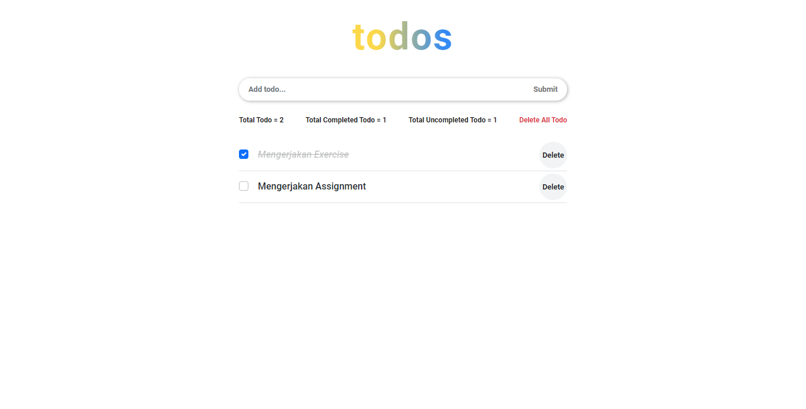
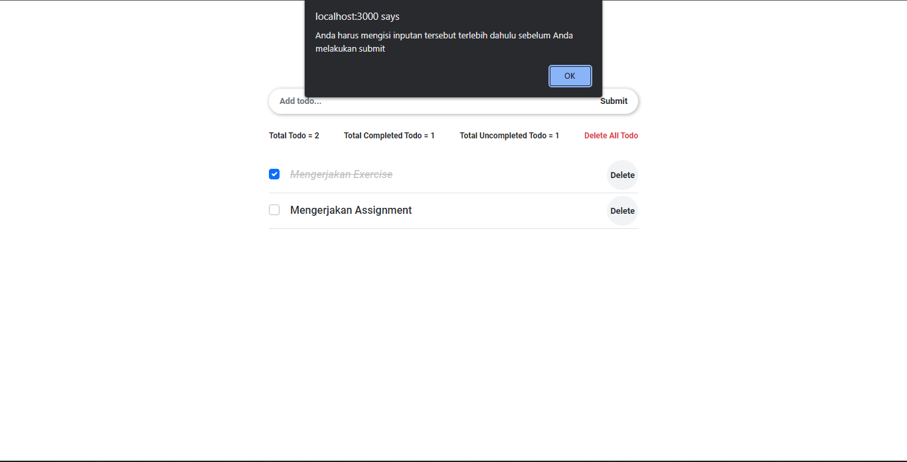
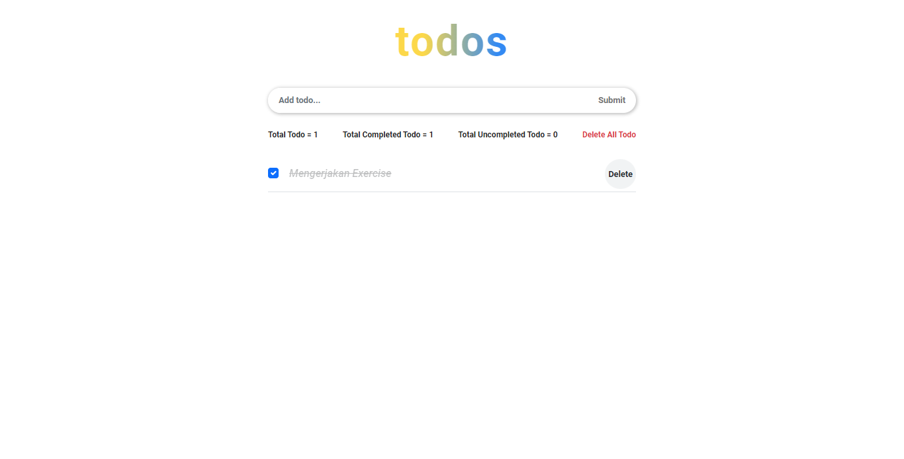
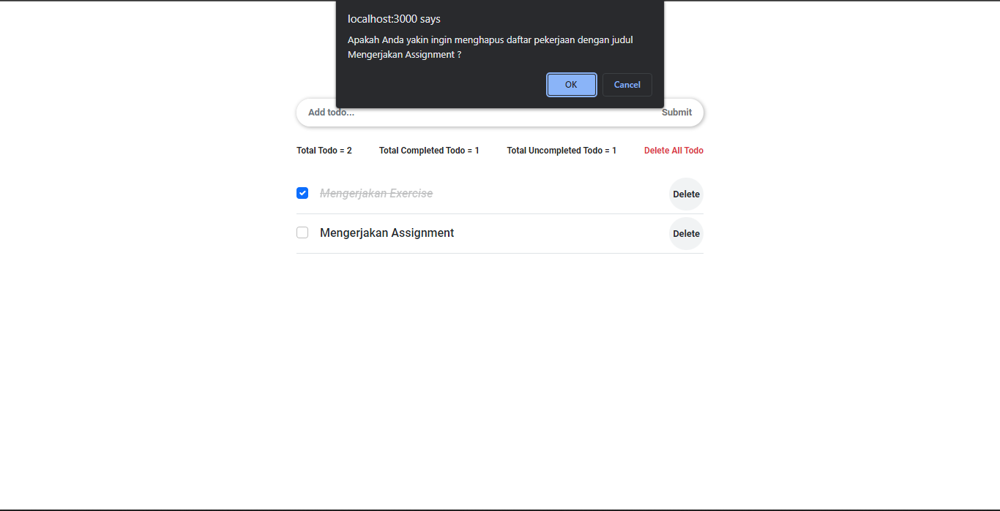

# (13) Event Handling

## Resume

Point yang dipelajari adalah:

1. State
2. Stateful dan Stateless Component
3. Handling Events

### State

#### Apa itu state?

_**State**_ adalah data _private_ pada sebuah _component_. Data ini hanya tersedia untuk _component_ tersebut dan tidak bisa diakses dari _component_ lainnya.

#### Beberapa point mengenai State pada React

1. Data hanya bisa dimodifikasi menggunakan `setState`.
2. Setiap terjadi modifikasi akan terjadi _render_ ulang pada _component_ tersebut.
3. Perubahan bersifat _asynchronous_.
4. Dipakai dalam _class_.

#### Perbedaan Props dan State

| Props                                            | State                                                                         |
| ------------------------------------------------ | ----------------------------------------------------------------------------- |
| _**Props**_ datanya bersifat _read-only_         | _**State**_ datanya dapat dirubah dengan cara _asynchronous_                  |
| _**Props**_ tidak dapat diubah atau dimodifikasi | _**State**_ dapat diubah atau dimodifikasi menggunakan fungsi `this.setState` |

#### Contoh State

```js
class Clock extends React.Component {
	constructor(props) {
		super(props);
		this.state = { date: new Date() };
	}

	componentDidMount() {
		this.timerID = setInterval(() => this.tick(), 1000);
	}

	componentWillUnmount() {
		clearInterval(this.timerID);
	}

	tick() {
		this.setState({
			date: new Date(),
		});
	}

	render() {
		return (
			<div>
				<h1>Hello, world!</h1>
				<h2>It is {this.state.date.toLocaleTimeString()}.</h2>
			</div>
		);
	}
}

const root = ReactDOM.createRoot(document.getElementById("root"));
root.render(<Clock />);
```

### Stateful dan Stateless Component

#### Apa itu stateful component?

_**Stateful component**_ adalah _component_ yang memiliki _state_. _Component_ ini sebelum _React_ **v16.8** hanya bisa dibuat dengan menggunakan _class_. Kelebihan dari _class component_ adalah memiliki _lifecycle_.

#### Apa itu stateless component?

_**Stateless component**_ adalah _component_ yang tidak memiliki _state_ dan hanya memiliki _props_. Pada _React_ **v16.8** _component_ ini dibuat dengan menggunakan _function_ karena codenya lebih ringkas dibangdingkan dengan menggunakan _class_.

#### Komponen stateful dan stateless memiliki banyak nama yang berbeda yaitu:

1. _Smart component_ (**stateful**) dan _Dump component_ (**stateless**)
2. _Container component_ (**stateful**) dan _Presentational component_ (**stateless**)

#### Perbedaan dari stateful dan stateless component

| Stateful Component                            | Stateless Component                                 |
| --------------------------------------------- | --------------------------------------------------- |
| Mengerti tentang aplikasi                     | Tidak mengerti tentang aplikasi                     |
| Melakukan data fetching atau pengambilan data | Tidak melakukan data fetching atau pengambilan data |
| Berinteraksi dengan aplikasi                  | Tujuan utamanya adalah visualisasi                  |
| Tidak dapat digunakan kembali                 | Dapat digunakan kembali                             |
| Meneruskan status dan data ke child           | Hanya berkomunikasi dengan parent secara langsung   |

#### Contoh Stateful component

```js
import { Component } from "react";
import Child from "./child";

class Parent extends Component {
	constructor(props) {
		super(props);
		this.state = {
			nilai: 1,
		};
	}

	render() {
		return (
			<div>
				<Child nilai={this.state.nilai} />
			</div>
		);
	}
}
```

#### Contoh Stateless component

```js
import { Component } from "react";

class Child extends Component {
	render() {
		return (
			<div>
				<p>Hasilnya adalah {this.props.nilai}</p>
			</div>
		);
	}
}

export default Child;
```

### Handling Events

#### Apa itu handling event?

_**Handling event**_ adalah suatu metode untuk menangani sebuah _event_ atau aksi yang diberikan pengguna kepada suatu _component_. Sedangkan _event_ adalah suatu peristiwa yang dipicu oleh pengguna pada suatu _component_, misalnya tombol ditekan dan lainnya.

#### Penulisan Event

Penulisan event pada _HTML_ dan _React_ tidak berbeda jauh atau hampir sama. Untuk di _HTML_ dalam penulisan _event_ menggunakan huruf kecil semua, sedangkan di _React_ menggunakan dalam penulisan _event_ menggunakan _camelCase_.

##### Contoh penulisan event di HTML

```html
<button onclick="activateLasers()">Activate Lasers</button>
```

##### Contoh penulisan event di React

```js
<button onClick="activateLasers()">Activate Lasers</button>
```

#### Beberapa contoh list Event pada React

| Event            | Contoh                              |
| ---------------- | ----------------------------------- |
| Clipboard Events | Promise terpenuhi                   |
| Form Events      | onChange, onSubmit                  |
| Mouse Events     | onClick, onDoubleClick, onMouseOver |
| Generic Events   | onError, onLoad                     |

#### Contoh code dalam penanganan event

```js
import { Component } from "react";

class Test extends Component {
	constructor(props) {
		super(props);
	}

	eventClick = () => {
		const h1 = document.querySelector("div h1");
		h1.style.color = "red";
		console.log(h1);
	};

	render() {
		return (
			<div>
				<h1 onClick={this.eventClick}>Hello, World!</h1>
			</div>
		);
	}
}

export default Test;
```

## Task

### 1. Membuat sebuah daftar pekerjaan yang akan dilakukan

Pada tugas ini yaitu membuat sebuah daftar pekerjaan yang akan saya lakukan dengan kriteria sebagai berikut:

1. Daftar pekerjaan dapat ditambahkan menggunakan inputan.
2. Terdapat checklist pada setiap daftar pekerjaan.
3. Aktifkan checklist jika pekerjaan selesai dikerjakan.
4. Sertakan tombol hapus untuk menghapus suatu pekerjaan dari daftar pekerjaan.
5. Apabila inputan yang disubmit tersebut kosong, tampilkan alert bahwa harus mengisi inputan tersebut terlebih dahulu sebelum melakukan submit.

(\*) Kerapihan dan inovasi menjadi suatu nilai tambah.

Note: Pada tugas ini saya melakukan inovasi dengan menambahkan beberapa fitur yaitu alert saat ingin menghapus salah satu data, tampilan saat data todo kosong, informasi total semua todo, informasi total todo yang sudah di selesaikan, informasi total todo yang belum diselesaikan, menghapus semua data, dan alert saat ingin menghapus semua data.

Berikut untuk link soal lebih lengkapnya:

[soal-praktikum-event-handling](https://docs.google.com/document/d/1cjjWtsrlI3KNonkYoM90xqYgr4dCwZK83jHwaXRVeNk/edit)

#### Fitur Utama

##### Tampilan Awal Aplikasi

Berikut adalah _source code_ dari tampilan awal aplikasi daftar tugas atau todo list:

[source-code](https://github.com/Bimahayunugraha/react_bima-hayu-nugraha/tree/13_Event_Handling/13_Event_Handling/praktikum)

Berikut adalah hasil _output_ dari tampilan awal aplikasi daftar tugas atau todo list:



##### Tampilan alert saat ingin melakukan submit, tetapi inputan kosong

Berikut adalah _source code_ dari tampilan alert saat ingin melakukan submit, tetapi inputan kosong:

[source-code](./praktikum/src/pages/Todo/Todo.jsx)

Berikut adalah hasil _output_ dari tampilan alert saat ingin melakukan submit, tetapi inputan kosong:



##### Tampilan menambahkan data daftar pekerjaan

Berikut adalah _source code_ dari tampilan menambahkan data daftar pekerjaan:

[source-code-1](./praktikum/src/pages/components/TodoInput/TodoInput.jsx)

[source-code-2](./praktikum/src/pages/Todo/Todo.jsx)

Berikut adalah hasil _output_ dari tampilan menambahkan data daftar pekerjaan:


##### Tampilan mengaktifkan checklist saat pekerjaan selesai dikerjakan

Berikut adalah _source code_ dari tampilan mengaktifkan checklist saat pekerjaan selesai dikerjakan:

[source-code-1](./praktikum/src/pages/components/TodoList/TodoList.jsx)

[source-code-2](./praktikum/src/pages/Todo/Todo.jsx)

Berikut adalah hasil _output_ dari tampilan mengaktifkan checklist saat pekerjaan selesai dikerjakan:


##### Tampilan saat data sudah terhapus

Berikut adalah _source code_ dari tampilan saat data sudah terhapus:

[source-code-1](./praktikum/src/pages/components/TodoList/TodoList.jsx)

[source-code-2](./praktikum/src/pages/Todo/Todo.jsx)

Berikut adalah hasil _output_ dari tampilan saat data sudah terhapus:



#### Fitur Tambahan

##### Tampilan alert saat ingin menghapus salah satu data

Berikut adalah _source code_ dari tampilan alert saat ingin menghapus salah satu data:

[source-code](./praktikum/src/pages/components/TodoList/TodoList.jsx)

Berikut adalah hasil _output_ dari tampilan alert saat ingin menghapus salah satu data:



##### Tampilan info todo

Berikut adalah _source code_ dari tampilan info todo:

[source-code-1](./praktikum/src/pages/components/InfoTodo/InfoTodo.jsx)

[source-code-2](./praktikum/src/pages/Todo/Todo.jsx)

Berikut adalah hasil _output_ dari tampilan info todo:


##### Tampilan alert saat ingin menghapus semua data

Berikut adalah _source code_ dari tampilan alert saat ingin menghapus semua data:

[source-code](./praktikum/src/pages/components/InfoTodo/InfoTodo.jsx)

Berikut adalah hasil _output_ dari tampilan alert saat ingin menghapus semua data:


##### Tampilan saat data daftar pekerjaan kosong

Berikut adalah _source code_ dari tampilan saat data daftar pekerjaan kosong:

[source-code-1](./praktikum/src/pages/components/EmptyTodo/EmptyTodo.jsx)

[source-code-2](./praktikum/src/pages/Todo/Todo.jsx)

Berikut adalah hasil _output_ dari tampilan saat data daftar pekerjaan kosong:


