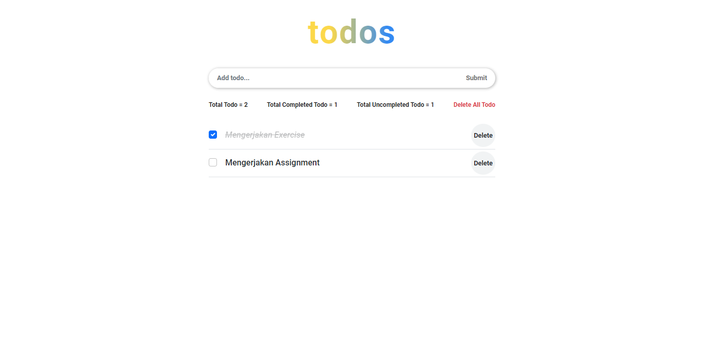
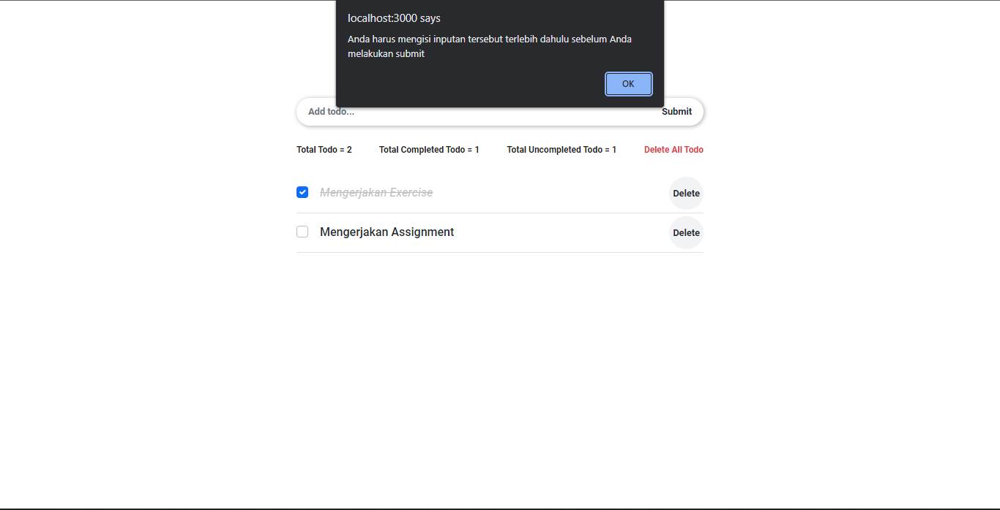
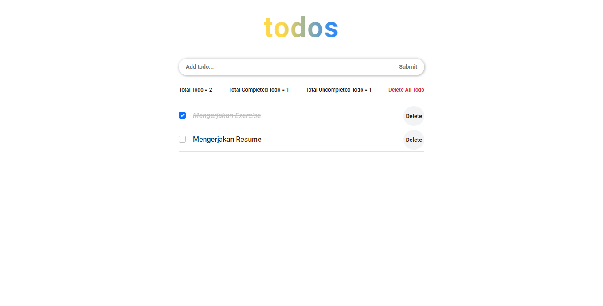
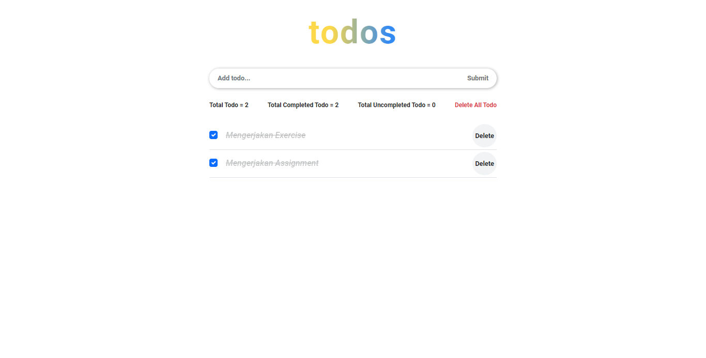
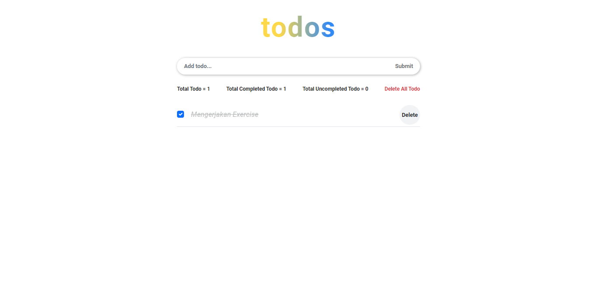
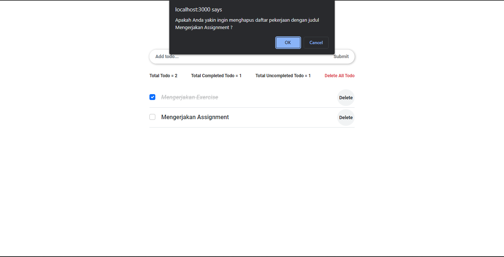
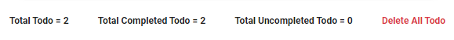
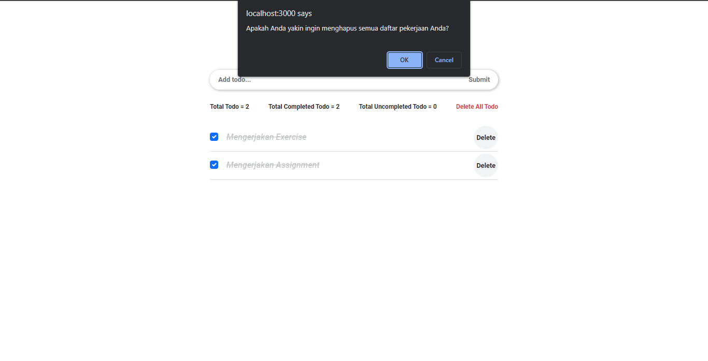
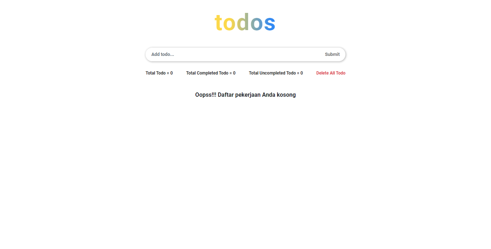

# (14) React Hook

## Resume

Point yang dipelajari adalah:

1. Pengenalan React Hooks
2. Bagaimana cara mengimplementasikan useState dan useEffect di komponen React
3. Bagaimana cara membuat custom Hooks

### Pengenalan React Hooks

#### Apa itu React Hooks

_**React hooks**_ adalah fitur baru di _React_ versi **16.8**. Dengan menggunakan _hooks_, kita dapat menggunakan _state_ dan fitur _React_ yang lain tanpa perlu menulis sebuah _class_.

#### Motivasi yang mendasari dibuatnya React Hooks

1. Kesulitan untuk menggunakan kembali _stateful logic_ antar komponen\
   Jadi, sebelumnya _React_ tidak memberikan cara untuk menyisipkan suatu _behaviour_ yang dapat digunakan kembali ke sebuah komponen, tetapi dengan _hooks_ kita dapat mengesktrak _stateful logic_ dari sebuah komponen, sehingga dapat dilakukan _testing_ secara independen dan juga dapat digunakan kembali. Jadi, dengan _hooks_ dapat menggunakan kembali _stateful logic_ tanpa mengubah hirarki dari komponen.
2. Komponen kompleks menjadi sulit untuk dimengerti\
   Kita sering menemui kesulitan untuk memelihata memelihara komponen yang awalnya sederhana, tetapi seiring berjalannya waktu komponen ini akan berubah menjadi kompleks dengan _stateful logic_ yang rumit dan berbagai efek samping. Setiap _lifecycle method_ berisi campuran dari logika yang tidak berhubungan sama sekali. Contohnya, komponen melakukan pengambilan data di _componentDidMount_ dan _componentDidUpdate_. Namun, _method_ _componentDidMount_ yang sama juga terdapat logika yang tidak berkaitan, seperti memasang _event listener_, dengan pembersihannya yang dilakukan di _componentWillUnmount_. Kode yang berhubungan berjauhan, tetapi kode yang tidak berhubungan justru berada pada satu _method_ yang sama. Hal ini rentan untuk menghasilkan _bug_ dan ketidakkonsistenan.

   Untuk mengatasi hal ini, **Hooks mampu untuk memecah satu komponen besar menjadi beberapa fungsi kecil yang berisi bagian-bagian yang saling berhubungan.**

3. Class membingungkan manusia dan mesin\
   Selain membuat penggunaan kode kembali dan pengorganisasian kode menjadi lebih sulit, kelas menjadi penghalang besar untuk mempelajari React. **Hooks mampu untuk menggunakan fitur React tanpa menggunakan kelas.**

#### Hooks pada React

| Hooks Dasar | Hooks Tambahan      |
| ----------- | ------------------- |
| useState    | useReducer          |
| useEffect   | useCallback         |
| useContext  | useMemo             |
|             | useRef              |
|             | useImperativeHandle |
|             | useLayoutEffect     |
|             | useDebugValue       |

#### Aturan pada Hooks

1. Hanya panggil _hooks_ di tingkat atas\
   Jangan memanggil _hooks_ dari dalam _loops_, _conditions_, atau _nested functions_.
2. Hanya panggil _hooks_ dari fungsi-fungsi _React_\
   Jangan memanggil _hooks_ dari fungsi-fungsi _Javascript_ biasa, tetapi dapat memanggil _hooks_ dengan cara: - Memanggil _hooks_ dari komponen-komponen fungsi _React_. - Memanggil _hooks_ dari _custom hooks_.

### Bagaimana cara mengimplementasikan useState dan useEffect di komponen React

#### Menggunakan useState

`useState()` adalah sebuah _hooks_ yang dapat mengembalikan nilai dari _state_ dan fungsi yang bisa digunakan untuk mengubah nilai tersebut

#### Menggunakan useEffect

`useEffect()` adalah _effect Hook_ yang memungkinkan kita melakukan _side effects_ di dalam _function component_. _useEffect_ mirip dengan _componentDidMount_, _componentDidUpdate_, dan _componentWillUnmount_. Ada dua jenis _useEffect_ yaitu:

1. useEffect yang butuh pembersihan atau efek dengan pembersihan\
   Beberapa efek dapat melakukan pembersihan, contohnya mengatur _subscription_ ke beberapa sumber data eksternal. Dalam hal ini, penting untuk membersihkan agar tidak menyebabkan kebocoran memori.

2. useEffect yang tidak butuh pembersihan atau efek tanpa pembersihan\
   Pada jenis ini, seperti memperbarui _DOM_, permintaan jaringan, mutasi _DOM_ secara manual, atau pencatatan yang tidak butuh pembersihan.

### Bagaimana cara membuat custom Hooks

#### Apa itu Custom Hooks

_**Custom hooks**_ adalah _hooks_ yang dibuat sendiri tanpa bawaan dari _React_ yang memiliki manfaat yaitu memungkinkan untuk mengekstrak komponen logika ke fungsi yang dapat digunakan kembali.

## Task

### 1. Mengubah tugas pada Section 13 - Event Handling yang awalnya Class Component menjadi Function Component

Pada tugas ini yaitu mengubah tugas pada Section 13 - Event Handling yang awalnya Class Component menjadi Function Component. Sekaligus mengubah lifecycle method & state management menggunakan React hooks.

Berikut untuk link soal lebih lengkapnya:

[soal-praktikum-react-hook](https://docs.google.com/document/d/1ayzau-Y06qOJ7pVymc_EUw9EEaeBAuTawySX2hnPizE/edit?usp=sharing)

#### Fitur Utama

##### Tampilan Awal Aplikasi

Berikut adalah _source code_ dari tampilan awal aplikasi daftar tugas atau todo list:

[source-code](https://github.com/Bimahayunugraha/react_bima-hayu-nugraha/tree/13_Event_Handling/13_Event_Handling/praktikum)

Berikut adalah hasil _output_ dari tampilan awal aplikasi daftar tugas atau todo list:

##### Tampilan alert saat ingin melakukan submit, tetapi inputan kosong

Berikut adalah _source code_ dari tampilan alert saat ingin melakukan submit, tetapi inputan kosong:

[source-code](./praktikum/src/pages/Todo/Todo.jsx)

Berikut adalah hasil _output_ dari tampilan alert saat ingin melakukan submit, tetapi inputan kosong:

##### Tampilan menambahkan data daftar pekerjaan

Berikut adalah _source code_ dari tampilan menambahkan data daftar pekerjaan:

[source-code-1](./praktikum/src/pages/components/TodoInput/TodoInput.jsx)

[source-code-2](./praktikum/src/pages/Todo/Todo.jsx)

Berikut adalah hasil _output_ dari tampilan menambahkan data daftar pekerjaan:

##### Tampilan mengaktifkan checklist saat pekerjaan selesai dikerjakan

Berikut adalah _source code_ dari tampilan mengaktifkan checklist saat pekerjaan selesai dikerjakan:

[source-code-1](./praktikum/src/pages/components/TodoList/TodoList.jsx)

[source-code-2](./praktikum/src/pages/Todo/Todo.jsx)

Berikut adalah hasil _output_ dari tampilan mengaktifkan checklist saat pekerjaan selesai dikerjakan:

##### Tampilan saat data sudah terhapus

Berikut adalah _source code_ dari tampilan saat data sudah terhapus:

[source-code-1](./praktikum/src/pages/components/TodoList/TodoList.jsx)

[source-code-2](./praktikum/src/pages/Todo/Todo.jsx)

Berikut adalah hasil _output_ dari tampilan saat data sudah terhapus:

#### Fitur Tambahan

##### Tampilan alert konfirmasi saat ingin menghapus salah satu data

Berikut adalah _source code_ dari tampilan alert konfirmasi saat ingin menghapus salah satu data:

[source-code](./praktikum/src/pages/components/TodoList/TodoList.jsx)

Berikut adalah hasil _output_ dari tampilan alert konfirmasi saat ingin menghapus salah satu data:

##### Tampilan info todo

Berikut adalah _source code_ dari tampilan info todo:

[source-code-1](./praktikum/src/pages/components/InfoTodo/InfoTodo.jsx)

[source-code-2](./praktikum/src/pages/Todo/Todo.jsx)

Berikut adalah hasil _output_ dari tampilan info todo:

##### Tampilan alert konfirmasi saat ingin menghapus semua data

Berikut adalah _source code_ dari tampilan alert konfirmasi saat ingin menghapus semua data:

[source-code](./praktikum/src/pages/components/InfoTodo/InfoTodo.jsx)

Berikut adalah hasil _output_ dari tampilan alert konfirmasi saat ingin menghapus semua data:

##### Tampilan saat data daftar pekerjaan kosong

Berikut adalah _source code_ dari tampilan saat data daftar pekerjaan kosong:

[source-code-1](./praktikum/src/pages/components/EmptyTodo/EmptyTodo.jsx)

[source-code-2](./praktikum/src/pages/Todo/Todo.jsx)

Berikut adalah hasil _output_ dari tampilan saat data daftar pekerjaan kosong:

