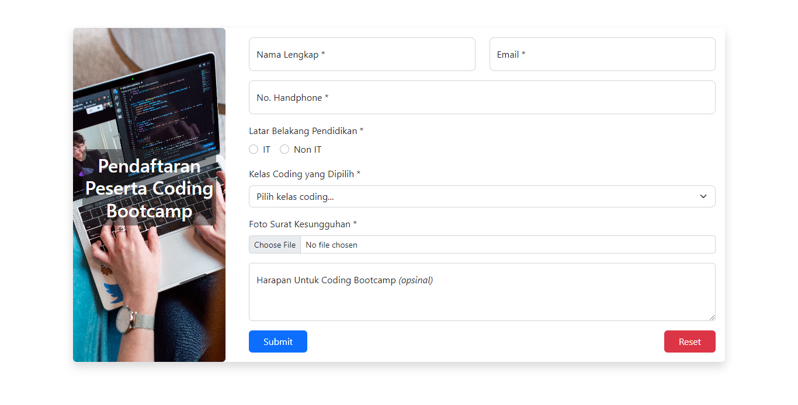
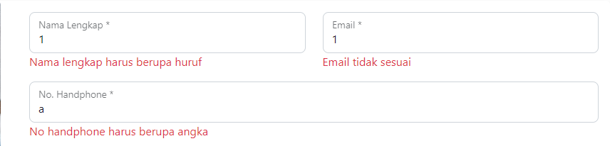
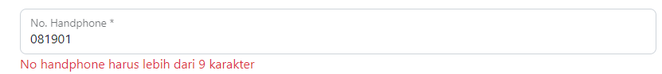
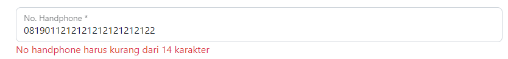
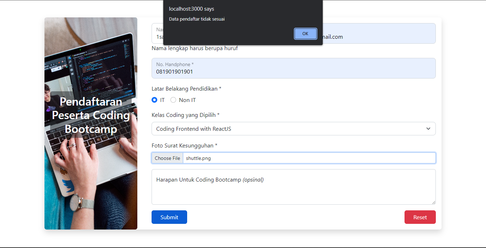
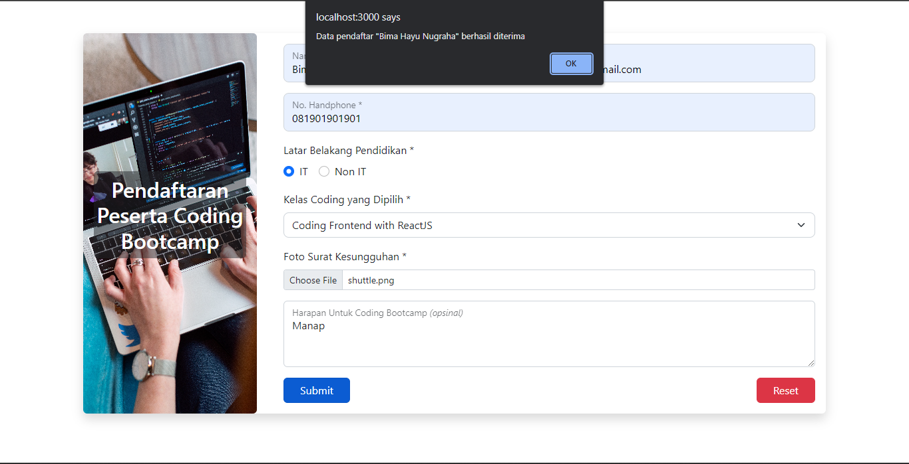

# (16) React Form

## Resume

Point yang dipelajari adalah:

1. Basic Form
2. Penjelasan Controlled, Uncontrolled Component, dan Uncontrolled vs Controlled Component
3. Basic Validation Pada Form di React

### Basic Form

#### Penggunaan Form

_**Form**_ merupakan salah satu hal yang krusial dalam pengembangan suatu aplikasi berbasis _website_. _Form_ dapat digunakan untuk menghandle inputan dari pengguna berupa _string_, _number_, atau lainnya. _Form_ banyak dijumpai saat _login_, mendaftarkan sesuatu, memberikan _feedback_, mengisi data, dan lainnya.

#### Macam-macam Form yang ada di React

1. _Element_ `<input>`\
   _Element_ `<input>` biasanya digunakan untuk inputan yang tidak terlalu panjang. Berikut adalah contoh dari penggunaan _element_ `<input>`:

   ```html
   <label>
   	<p>Nama</p>
   	<input name="nama" />
   </label>
   ```

2. _Element_ `<textarea>`\
   _Element_ `<textarea>` biasanya digunakan untuk inputan yang cukup panjang. Berikut adalah contoh dari penggunaan _element_ `<textarea>`:

   ```html
   <label>
   	<p>Deskripsi</p>
   	<textarea name="deskripsi"></textarea>
   </label>
   ```

3. _Element_ `<select>`\
   _Element_ `<select>` biasanya digunakan untuk inputan yang pilihannya sudah ditentukan. Berikut adalah contoh dari penggunaan _element_ `<select>`:

   ```html
   <label>
   	<p>Apel</p>
   	<select name="apel">
   		<option value="">--Pilih Salah Satu--</option>
   		<option value="fuji">Fuji</option>
   		<option value="jonathan">Jonathan</option>
   		<option value="honey">Honey</option>
   	</select>
   </label>
   ```

4. Radio Button\
   _**Radiobutton**_ merupakan salah satu type di element `<input>`. Hanya bisa memilih 1 pilihan saja menggunakan _radiobutton_. Berikut adalah contoh dari penggunaan _element radiobutton_:

   ```html
   <label>
   	<p>Jenis Kelamin</p>
   	<input type="radio" name="laki-laki" values="laki-laki" /> Laki-laki <input type="radio" name="perempuan" values="perempuan" /> Perempuan
   </label>
   ```

5. Checkbox\
   _**Checkbox**_ merupakan salah satu type di _element_ `<input>`. Bisa memilih lebih dari 1 pilihan menggunakan _checkbox_. Berikut adalah contoh dari penggunaan _element_ _checkbox_:

   ```html
   <label>
   	<p>Kelas Yang Diambil</p>
   	<input type="checkbox" name="pagi" values="pagi" /> Pagi <input type="checkbox" name="siang" values="siang" /> Siang
   	<input type="checkbox" name="sore" values="sore" /> Sore
   </label>
   ```

#### Type element input lainnya

Selain yang sudah disebutkan sebelumnya, masih banyak lagi _type element input_ yang lainnya yaitu:
| | | |
| --- | --- | --- |
| text (default) | image | submit |
| button | month | tel
| color | number | time
| checkbox | password | url
| date | radio | week
| datetime-local | range
| email | reset
| file | switch
| hidden | search

### Penjelasan Controlled, Uncontrolled Component, dan Uncontrolled vs Controlled Component

#### Controlled Component

##### Apa itu Controlled Component

Pada _HTML_, _element form_ seperti `<input>`, `<textarea>`, dan `<select>` biasanya menyimpan _state_ nya sendiri dan memperbaruinya berdasarkan masukan dari pengguna. Di _React_, _state_ yang dapat berubah seperti ini biasanya disimpan pada properti dari komponen dan hanya akan diubah menggunakan `setState()`.

Kita dapat menggabungkan cara menyimpan dan memperbarui _state_ di _HTML_ dan _React_ dengan menggunakan _state_ pada _React_. Kemudian, komponen _React_ yang merender sebuah _form_ juga mengontrol apa yang terjadi dalam _form_ tersebut pada masukan dari pengguna selanjutnya. Sebuah elemen masukan _form_ yang nilainya dikontrol oleh _React_ melalui cara seperti ini disebut sebagai _**Controlled Component**_. Berikut adalah contoh dari _Controlled Component_ untuk implementasi _form_:

```js
import React, { useState } from "react";

export default function NameForm() {
	const [name, setName] = useState("");

	const handleChange = (e) => {
		setName(e.target.value);
	};

	const handleSubmit = (e) => {
		alert("A name was submitted: " + name);
		e.preventDefault();
	};

	return (
		<form onSubmit={handleSubmit}>
			<label>
				Nama:
				<input type="text" value={name} onChange={handleChange} />
			</label>
			<input type="submit" value="Submit" />
		</form>
	);
}
```

##### Bagaimana cara mengimplementasikan Controlled Component di dalam Tag `<textarea>`

_Textarea_ pada _HTML_\
Pada _HTML_, _element_ `<textarea>` mendefinisikan teks di dalamnya sebagai _element_ anaknya. Berikut adalah contoh dari penggunaan _element_ `<textarea>` pada _HTML_:

```html
<textarea>Hello there this is same text in a text area</textarea>
```

Sedangkan di _React_, _element_ `<textarea>` menggunakan _attribut value_. Dengan cara ini, sebuah _form_ yang menggunakan `<textarea>` dapat ditulis dengan cara yang sangat mirip dengan sebuah _form_ yang menggunakan _input_ satu baris. Berikut adalah contoh dari penerapan _Controlled Component_ pada _element_ `<textarea>` di _React_:

```js
import React, { useState } from "react";

export default function EssayForm() {
	const [essay, setEssay] = useState("Please write an essay about your favorite DOM element.");

	const handleSubmit = (e) => {
		alert("An essay was submitted: " + essay);
		e.preventDefault();
	};

	return (
		<form onSubmit={handleSubmit}>
			<label>
				Nama:
				<textarea value={essay} onChange={(e) => setEssay(e.target.value)} />
			</label>
			<input type="submit" value="Submit" />
		</form>
	);
}
```

##### Bagaimana cara mengimplementasikan Controlled Component di dalam Tag `<select>`

Pada _HTML_ vs _React_\
Pada _HTML_, _element_ `<select>` membuat sebuah daftar dropdown. Berikut adalah contoh dari penggunaan _element_ `<select>` pada _HTML_:

```html
<select>
	<option value="grapefruit">Grapefruit</option>
	<option value="lime">Lime</option>
	<option selected value="coconut">Coconut</option>
	<option value="mango">Mango</option>
</select>
```

Pada contoh diatas bahwa opsi “Coconut” dipilih karena adanya _attribut selected_. Sedangkan di _React_, alih-alih menggunakan _attribut selected_, kita bisa menggunakan attribut _value_ di _tag_ `<select>`. Hal ini dapat lebih mudah karena hanya perlu diubah di satu tempat saja. Berikut adalah contoh dari penerapan _Controlled Component_ pada _element_ `<select>` di _React_:

```js
import React, { useState } from "react";

export default function FlavorForm(params) {
	const [flavor, setFlavor] = useState("coconut");

	const handleSubmit = (e) => {
		alert("Your favorite flavor is: " + flavor);
		e.preventDefault();
	};

	return (
		<form onSubmit={handleSubmit}>
			<label>
				Pick your favorite flavor:
				<select value={flavor} onChange={(e) => setFlavor(e.target.value)}>
					<option value="grapefruit">Grapefruit</option>
					<option value="lime">Lime</option>
					<option value="coconut">Coconut</option>
					<option value="mango">Mango</option>
				</select>
			</label>
			<input type="submit" value="Submit" />
		</form>
	);
}
```

Kita bisa memasukkan _array_ ke _attribut value_ yang memungkinkan dapat memilih beberapa opsi dalam _tag_ `<select>`. Berikut adalah contohnya:

```js
<select multiple={true} value={["B", "C"]}></select>
```

##### Bagaimana cara menghandle banyak input di Controlled Component

Dengan Attribut name\
Ketika membutuhkan penanganan banyak _element_ pada _Controlled Component_, kita dapat **menambahkan _attribut name_ pada setiap _element_** dan **membiarkan fungsi _handler_ memilih apa yang harus dilakukan berdasarkan nilai dari `event.target.name`**. Berikut adalah contohnya:

```js
<label>
	Is going:
	<input name="isGoing" type="checkbox" checked={inputs.isGoing} onChange={handleInputChange} />
</label>
```

Cara handle inputnya

```js
const [inputs, setInputs] = useState({ isGoing: false, numberOfGuests: 0 });

const handleInputChange = (e) => {
	const target = e.target;
	const value = target.type === "checkbox" ? target.checked : target.value;
	const name = target.name;

	setInputs({
		...inputs,
		[name]: value,
	});
};
```

#### Uncontrolled Component

_**Uncontrolled component**_ adalah alternatif lain dari _controlled component_, dimana data _form_ akan ditangani oleh _DOM_. Untuk menulis _uncontrolled component_, alih-alih menulis _event handler_ untuk setiap pembaruan _state_, kita bisa menggunakan _ref_ untuk mendapatkan nilai _form_ dari _DOM_. Karena dengan hal ini, terkadang lebih mudah untuk mengintegrasikan kode _React_ dan non-_React_ jika menggunakan _uncontrolled component_. Berikut adalah contoh dari _uncontrolled component_:

```js
import React, { useRef } from "react";

export default function NameForm() {
	const input = useRef("");

	const handleSubmit = (e) => {
		alert("Sebuah nama telah dikirim: " + input.current.value);
		e.preventDefault();
	};

	return (
		<form onSubmit={handleSubmit}>
			<label>
				Nama:
				<input type="text" ref={input} />
			</label>
			<input type="submit" value="Kirim" />
		</form>
	);
}
```

##### Nilai Default yang ada dalam Uncontrolled Component

Pada _lifecycle rendering React_, _attribut value_ pada _element_ `<form>` akan menimpa nilai pada _DOM_. Dengan _uncontrolled component_, sering kali ingin _React_ dapat menentukan nilai awal, tetapi pembaruan berikutnya dilakukan secara _uncontrolled_. Untuk menanganinya dapat menggunakan _attribut_ `defaultValue`. Berikut adalah contoh penerapan `defaultValue` pada _form_:

```js
return (
	<form onSubmit={handleSubmit}>
		<label>
			Nama:
			<input defaultValue="Budi" type="text" ref={input} />
		</label>
		<input type="submit" value="Kirim" />
	</form>
);
```

Kita bisa menggunakan `defaultChecked` untuk

```html
<input type="”checkbox”" />
```

dan

```html
<input type="”radio”" />
```

Serta `defaultValue` untuk `<select>` dan `<textarea>`.

##### Bagaimana cara menggunakan Uncontrolled Component pada Tag File Input

Pada _HTML_, sebuah _element_ `<input type=”file”>` memungkinkan pengguna untuk memilih satu atau beberapa _file_ dari media penyimpanan untuk diunggah ke _server_ atau dimanipulasi dengan _Javascript_ melalui _file API_.

Sedangkan dalam _React_, sebuah _element_ `<input type=”file” />` merupakan _uncontrolled component_ karena nilainya hanya bisa diset oleh pengguna, bukan oleh kode program.

```js
import React, { useRef } from "react";

export default function FileInput() {
	const fileInput = useRef("");

	const handleSubmit = (e) => {
		e.preventDefault();
		alert(`Selected file - ${fileInput.current.files[0].name}`);
	};

	return (
		<form onSubmit={handleSubmit}>
			<label>
				Upload file:
				<input type="file" ref={fileInnput} />
			</label>
			<br />
			<button type="submit">Submit</button>
		</form>
	);
}
```

#### Uncontrolled vs Controlled Component

##### Uncontrolled Component

_Input_ yang tidak terkontrol seperti **_input_ formulir pada _HTML_ tradisional**. Berikut adalah contohnya:

```js
export default function Form {
    return {
        <div>
            <input type="text" />
        </div>
    }
}
```

Inti dari _uncontrolled component_ adalah kita harus ‘menarik’ nilai dari _field_ saat membutuhkannya dan bisa terjadi ketika formulir di _submit_. Cara tersebut adalah cara paling sederhana untuk mengimplementasikan _input_ formulir, tetapi _uncontrolled input_ tidak powerful.

##### Controlled Component

Sebuah **_controlled input_** menerima nilai saat ini sebagai _prop_, serta _callback_ untuk mengubah nilai tersebut. Cara ini adalah cara yang lebih “_**React Way**_” yang berarti tidak harus selalu menggunakannya. Tetapi nilai _input_ ini haris ada di _state_ yang disimpan di suatu tempat. Biasanya, komponen yang merender _input_ adalah _form component_ yang menyimpannya di _state_ atau penyimpanan _state_ terpisah, seperti _Redux_. Berikut adalah contohnya:

```js
import React, { useState } from "react";

export default function Form() {
	const [name, setName] = useState("");

	const handleNameChange = (e) => {
		setName(e.target.value);
	};

	return (
		<div>
			<input type="text" value={name} onChange={handleNameChange} />
		</div>
	);
}
```

_Flow_ dari _Controlled Component_ adalah setiap kali mengetikkan karakter baru, maka `handleNameChange` akan dipanggil. Kemudian, dibutuhkan nilai baru dari _input_ dan mengaturnya di _state_.

##### Apa yang membuat suatu element menjadi Controlled

Selain _input_ biasa, ada _element_ bentuk lain seperti _checkbox_, _radio_, _select_, dan _textarea_. _Element_ formulir menjadi _**“controlled”**_ jika menetapkan nilainya melalui _prop_. Namun, masing-masing _element_ formulir memiliki _prop_ yang berbeda untuk menetapkan nilai tersebut. Berikut adalah perbedaan dari masing-masing _element_ formulir untuk menjadikannya sebagai _Controlled Component_:

| Element                     | Value property       | Change callback | New value in callback  |
| --------------------------- | -------------------- | --------------- | ---------------------- |
| `<input type=”text” />`     | value=”string”       | `onChange`      | `event.target.value`   |
| `<input type=”checkbox” />` | checked={boolean}    | `onChange`      | `event.target.checked` |
| `<input type=”radio” />`    | checked={boolean}    | `onChange`      | `event.target.checked` |
| `<textarea />`              | value=”string”       | `onChange`      | `event.target.value`   |
| `<select />`                | value=”option value” | `onChange`      | `event.target.value`   |

##### Kesimpulan

_Form controlled_ dan _uncontrolled_ memiliki kelebihannya masing-masing. Kita hanya perlu mengevaluasi situasi kita secara spesifik dan memilih pendekatan apa yang cocok untuk kondisinya. Jika formulir sangat sederhana dalam hal umpan balik _UI_, maka _uncontrolled_ dengan _ref_ sangat baik.

##### Perbedaan fitur-fitur yang adalah di Uncontrolled dan Controlled Component

| Fitur                                    | Uncontrolled | Controlled |
| ---------------------------------------- | ------------ | ---------- |
| On-time value retrieval (e.g. on submit) | &check;      | &check;    |
| Validating on submit                     | &check;      | &check;    |
| Instant field validation                 | &cross;      | &check;    |
| Conditionally disabling submit button    | &cross;      | &check;    |
| Enforcing input format                   | &cross;      | &check;    |
| Several inputs for one piece of data     | &cross;      | &check;    |
| Dynamic inputs                           | &cross;      | &check;    |

### Basic Validation Pada Form di React

#### Kenapa memerlukan validasi

Pada dasarnya, terdapat tiga alasan mengapa validasi _form_ diperlukan yaitu:

1. Mencari _input_ data yang benar dan sesuai format
2. Melindungi akun pengguna
3. Melindungi sistem atau aplikasi

#### Tipe validasi data formulir

1. _**Client-side validation**_\
   Pada validasi ini yaitu validasi yang dilakukan pada sisi klien atau _browser_. Validasi ini dilakukan agar data _input_ sesuai dengan kebutuhan _form_, sebelum data _form_ dikirimkan ke ser\*ver. Kelebihan validasi dari sisi klien adalah **\*user-friendly**_ karena jika terjadi kesalahan pengguna akan langsung diberitahu. Pengguna tidak harus menunggu respon dari \_server_ untuk mengetahui hasil validasinya. Validasi dari sisi klien dibagi menjadi dua bagian yaitu: - _**Built-in form validation**_, yaitu menggunakan fitur validasi langsung dari _HTML5_. Contohnya seperti _required_, _minlength_, _maxlength_, _min_, _max_, _type_, dan _pattern_. - **Menggunakan **Javascript\*\*\*\* yang membuat validasi pada _form_ dapat dikostumisasi, tetapi harus membuatnya sendiri.

2. _**Server-side validation**_\
   Pada validasi ini yaitu validasi yang dilakukan pada sisi _server_. Sisi _server_ berfungsi untuk memvalidasi data kembali, sebelum disimpan di _database_. Jika ditemukan kesalahan, maka respon akan dikirimkan kembali ke klien berupa koreksi atas kesalahan yang dibuat oleh pengguna. Validasi ini **tidak _user-friendly_** karena koreksi kesalahan akan dikirimkan setelah _form_ di _submit_.

#### Bulit-in form validation

1. _**Required**_\
   _**Required**_ digunakan untuk menentukan _field form_ harus diisi sebelum formulir dapat dikirimkan. Berikut adalah contoh dari penggunaan _required_:

   ```js
   <input required type="text" value={name} onChange={handleChange} />
   ```

2. _**Minlength**_ dan _**Maxlength**_\
   _**Minlength**_ dan _**Maxlength**_ digunakan untuk menentukan jumlah karakter minimal dan maksimal yang bisa dimasukkan. Berikut adalah contoh dari penggunaan _minlength_ dan _maxlength_:

   ```js
   <input minLength="4" maxLength="10" type="text" value={name} onChange={handleChange} />
   ```

3. _**Min**_ dan _**Max**_\
   _**Min**_ dan _**Max**_ digunakan untuk menentukan nilai minimum dan maksimum angka yang bisa dimasukkan. Berikut adalah contoh dari penggunaan _min_ dan _max_:

   ```js
   <input min="17" max="25" type="number" value={name} onChange={handleChange} />
   ```

4. _**Type**_\
   _**Type**_ digunakan untuk menentukan apakah data berupa angka, email, atau tipe lainnya. Berikut adalah contoh dari penggunaan _type_:

   ```js
   <input type="email" value={name} onChange={handleChange} />
   ```

5. _**Pattern**_\
   _**Pattern**_ digunakan untuk menentukan _regular expression_ (_**regex**_) yang mendefinisikan pola data yang boleh dimasukkan. Berikut adalah contoh dari penggunaan _pattern_:

   ```js
   <input pattern="^(buah \w*)" type="text" value={name} onChange={handleChange} />
   ```

##### Membuat validasi menggunakan Javascript

Untuk membuat validasi menggunakan _Javascript_ yaitu:

1. **Ketika ada perubahan di _form_**. Pada validasi ini ketika ada perubahan akan mentrigger _event_ `onChange`. Kelebihannya validasi akan cukup _**real-time**_ berdasarkan perubahan data, namun fungsi akan terus dipanggil selama ada perubahan dan dapat dikombinasikan dengan _disabled button_.
2. **Ketika menekan tombol _submit_**. Pada validasi ini ketika menenkan tombol submit, maka akan mentrigger _event_ `onSubmit`. Kelebihannya validasi cukup satu kali, tetapi **tidak akan _real-time_** dalam memvalidasi _form_.

## Task

### 1. Membuat form pendaftaran untuk peserta coding bootcamp

Pada tugas ini yaitu membuat form pendaftaran untuk peserta coding bootcamp dengan ketentuan sebagai berikut:

1. Field “Nama lengkap" wajib, hanya menerima huruf"
2. Field “Email" wajib
3. Field “No Handphone" wajib, panjangnya 9-14 karakter, berupa angka
4. Field “Latar Belakang Pendidikan" wajib, berupa radio button pilihannya IT dan Non IT
5. Field “Kelas Koding yang Dipilih" wajib. Pilihannya ada tiga yakni
   - Coding Backend with Golang
   - Coding Frontend with ReactJS
   - Fullstack Developer
6. Field “Foto Surat Kesungguhan" bersifat wajib.
7. Field “Harapan Untuk Coding Bootcamp Ini" bersifat opsional
8. Tombol “Submit" untuk mensubmit data dan mereset form. Bersifat wajib.
9. Tombol “Reset" untuk mereset form dan mereset pesan error. Bersifat tidak wajib.

Apabila ada error, bisa ditampilkan antara form dan tombol submit. Ketika tombol submit
ditekan, akan muncul alert baik ketika ada error maupun saat data benar. Utamakan
fungsionalitasnya. Kerapihan dan inovasi menjadi suatu nilai tambah

Berikut untuk link soal lebih lengkapnya:

[soal-praktikum-react-form](https://docs.google.com/document/d/1OqHWRAtUJUfKeQsdvji8hKolHI2cHMAs4DuCHRZ31Hc/edit?usp=sharing)

#### Tampilan Awal Aplikasi

Berikut adalah _source code_ dari tampilan awal website form pendaftaran peserta coding bootcamp:

[source-code](https://github.com/Bimahayunugraha/react_bima-hayu-nugraha/tree/16_React_Form/16_React_Form/praktikum/src/pages/RegisterForm)

Berikut adalah hasil _output_ dari tampilan awal website form pendaftaran peserta coding bootcamp:



#### Tampilan Pesan Error Jika Tidak Sesuai Saat Melakukan Input Nama, Email, dan No Handphone

Berikut adalah _source code_ dari tampilan pesan error jika tidak sesuai saat melakukan input nama, email, dan no handphone:

[source-code-1](./praktikum/src/pages/RegisterForm/FormLists/FormLists.jsx)

[source-code-2](./praktikum/src/pages/RegisterForm/Form.jsx)

Berikut adalah hasil _output_ dari tampilan pesan error jika tidak sesuai saat melakukan input nama, email, dan no handphone:



#### Tampilan Pesan Error Jika Saat Melakukan Input No Handphone Kurang Dari 9 Karakter

Berikut adalah _source code_ dari tampilan Pesan error jika saat melakukan input no handphone kurang dari 9 karakter:

[source-code-1](./praktikum/src/pages/RegisterForm/FormLists/FormLists.jsx)

[source-code-2](./praktikum/src/pages/RegisterForm/Form.jsx)

Berikut adalah hasil _output_ dari tampilan Pesan error jika saat melakukan input no handphone kurang dari 9 karakter:



#### Tampilan Pesan Error Jika Saat Melakukan Input No Handphone Lebih Dari 14 Karakter

Berikut adalah _source code_ dari tampilan Pesan error jika saat melakukan input no handphone lebih dari 14 karakter:

[source-code-1](./praktikum/src/pages/RegisterForm/FormLists/FormLists.jsx)

[source-code-2](./praktikum/src/pages/RegisterForm/Form.jsx)

Berikut adalah hasil _output_ dari tampilan Pesan error jika saat melakukan input no handphone lebih dari 14 karakter:



#### Tampilan Alert Jika Data Nama, Email, atau No Handphone Yang Diinputkan Tidak Sesuai

Berikut adalah _source code_ dari tampilan alert jika data nama, email, atau no handphone yang diinputkan tidak sesuai:

[source-code](./praktikum/src/pages/RegisterForm/Form.jsx)

Berikut adalah hasil _output_ dari tampilan alert jika data nama, email, atau no handphone yang diinputkan tidak sesuai:



#### Tampilan Alert Jika Data Yang Diinputkan Berhasil Diterima

Berikut adalah _source code_ dari tampilan alert jika data yang diinputkan berhasil diterima:

[source-code](./praktikum/src/pages/RegisterForm/Form.jsx)

Berikut adalah hasil _output_ dari tampilan alert jika data yang diinputkan berhasil diterima:


