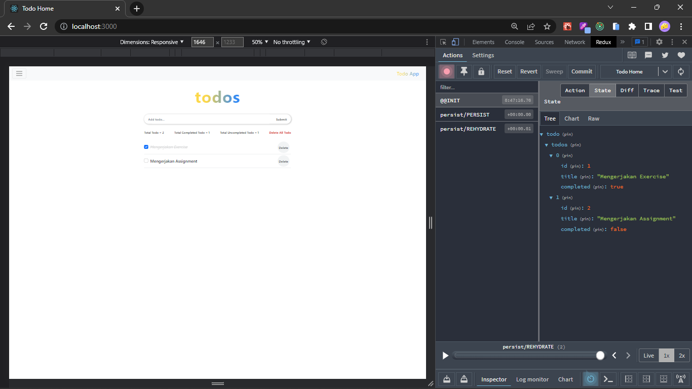
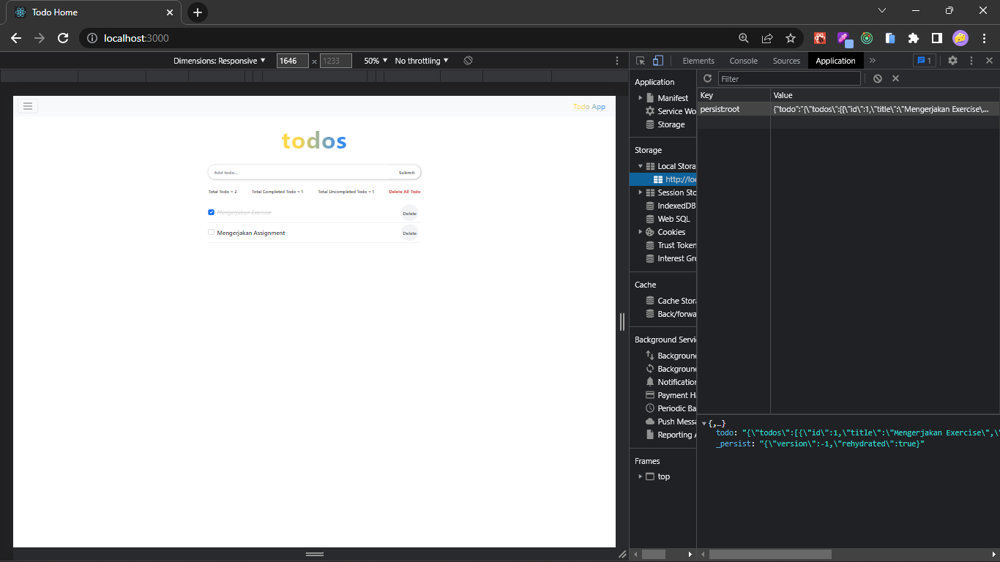

# (17) Global State Management and Data Fetching

## Resume

Point yang dipelajari adalah:

1. Redux untuk Global State Management pada React
2. Redux Thunk dan Persisted State pada React
3. Data Fetching pada React

### Redux untuk Global State Management pada React

#### Waktu yang tepat untuk menggunakan Redux

1. Banyak state yang perlu ditaruh di banyak tempat.
2. State pada app sering berubah.
3. Logic untuk mengubah state yang kompleks.
4. Ukuran codebase yang sedang – besar dan dikerjakan oleh banyak orang.
5. Perlu untuk mengetahui bahwa bagaimana state diupdate seiring berjalannya waktu.

#### Redux Libraries dan Tools yang sering dipakai

1. _**React Redux**_\
   _**Redux**_ dapat dipakai di _framework_ apapun dan paling sering digunakan di _React_. Ketika memakai _React_, cara yang mudah untuk berinteraksi dengan _Redux_ adalah dengan menggunakan _Library_ ini.
2. _**Redux Toolkit**_\
   _**Redux Toolkit**_ adalah _Library_ yang berisi _packages_ dan _function_ dan penting saat ingin membuat _Store Redux_ pada sebuah _project React_. Dengan menggunakan _Redux Toolkit code_ dapat lebih rapi dan _library_ ini sangat direkomendasikan oleh _Redux_.
3. _**Redux Devtools Extension**_\
   _**Redux Devtools Extension**_ adalah sebuah _extension_ dari _browser_ yang digunakan untuk melihat _history_ dari perubahan _state_ dan _state_ itu sendiri di _browser_ yang sangat memudahkan dalam proses _debugging_ pada _project_ yang dibuat.

#### Tiga komponen penting yang ada di Redux

1. _**Actions**_\
   Digunakan untuk memberikan informasi dari aplikasi ke _store_. Pemberian informasi ini sangat penting untuk merubah _state_ pada _store_ seperti saat pengguna melakukan interaksi, _internal event_, atau pemanggilan _API_. Pada _action_ memiliki dua properti yaitu:

   - _**Type**_\
     Konstanta untuk mengidentifikasi jenis tindakan pada _domain_ atau _eventname_.
   - _**Payload**_\
     Dapat berisi objek, _string_, _number_, atau lainnya yang berguna untuk menyimpan data yang akan dikirim ke _store_.

   Biasanya dalam pembuatan _action_ dengan menggunakan _function_ yang disebut _**Action Creator**_. _**Action creator**_ adalah sebuah fungsi untuk mengembalikan _action_. Berikut adalah contoh dari implementasi _action_:

   ```js
   const addTodo = text => {
       return (
           type: 'todos/todoAdded',
           payload: text
       )
   }
   ```

2. _**Reducer**_\
   _**Reducer**_ adalah sebuah fungsi _pure Javascript_ yang mengambil _state_ pada aplikasi saat ini dan _object action_, lalu mengembalikan _state_ aplikasi terbaru. Berikut adalah contoh dari implementasi _reducer_:

   ```js
   const initialState = { value: 0 };

   function counterReducer(state = initialState, action) {
   	// Check to see if the reducer cares about this action
   	if (action.type === "counter/increment") {
   		// Is so, make a copy of 'state'
   		return {
   			...state,
   			// and update the copy with the new value
   			value: state.value + 1,
   		};
   	}
   	// Otherwise return the existing state onchanged
   	return store;
   }
   ```

3. _**Store**_\
    _**Store**_ adalah objek sentral yang menyimpan _state_ pada aplikasi. Berikut adalah contoh dari implementasi _reducer_:

   ```js
   import { configureStore } from "@reduxjs/toolkit";

   const store = configureStore({ reducer: counterReducer });

   console.log(store.getState()); // { value:0 }
   ```

#### Terdapat dua cara untuk memakai dan mengubah state pada Redux Store

1. _**Hook**_\
   Cara ini direkomendasikan oleh _Redux_ karena simpel daripada _connect_. Berikut adalah contoh implementasi dari _hook_ pada _Redux Store_:

   ```js
   import React from "react";
   import { useSelector, useDispatch } from "react-redux";
   import { inCrement } from "./counterSlice";

   export function Counter() {
   	const count = useSelector((state) => state.counter.value);
   	const dispatch = useDispatch();

   	return (
   		<div>
   			<div>
   				<button aria-label="Increment Value" onClick={() => dispatch(increment())}>
   					Increment
   				</button>
   				<span>{count}</span>
   			</div>
   		</div>
   	);
   }
   ```

2. _**Connect**_\
   Dulunya _connect_ merupakan satu-satunya cara untuk memasang _state_ pada _Redux_ ke komponen dari _project_, tetapi setelah _Hook_ hadir cara ini ditinggalkan. Berikut adalah contoh implementasi dari _connect_ pada _Redux Store_:

   ```js
   import { connect } from "react-redux";

   const mapStateToProps = (state) => {
   	return (count: state.counter.value);
   };
   const mapDispatchProps = {
   	increment,
   };

   export default connect(mapStateToProps, mapDispatchProps)(Counter);
   ```

#### Kesimpulan

1. _**Redux**_ adalah _library_ untuk manajemen _state global_.
2. _**Redux**_ menggunakan struktur “_**one-way data flow**_”
3. _**Redux**_ menggunakan beberapa tipe _code_.

### Redux Thunk dan Persisted State pada React

#### Redux Thunk

##### Pengertian Redux Thunk

_**Redux Thunk**_ adalah _**Thunk Middleware**_ untuk _redux_ yang memungkinkan untuk membuat _**action creator**_ yang mengembalikan _**function**_ bukan _action_.

##### Alasan memerlukan Redux Thunk

Untuk menghandle _side effect logic_ seperti _logic synchronous_ kompleks yang perlu mengakses _store_ dan juga _logic async_ seperti _request data API_.

##### Berikut adalah contoh penggunaan Redux Thunk untuk Asynchronous Dispatch

```js
export default connect(mapStateToProps, mapDispatchProps)(Counter);

const INCREMENT_COUNTER = "INCREMENT_COUNTER";

function increment() {
	return {
		type: INCREMENT_COUNTER,
	};
}

function incrementAsync() {
	return (dispatch) => {
		setTimeout(() => {
			dispatch(increment());
		}, 1000);
	};
}
```

##### Berikut adalah contoh penggunaan Redux Thunk untuk Conditional Dispatch

```js
function incrementIfOdd() {
	return (dispatch, getState) => {
		const { counter } = getState();

		if (counter % 2 === 0) {
			return;
		}

		dispatch(increment());
	};
}
```

##### Cara menggunakan Redux Thunk

1. Dokumentasi dari Redux Thunk\
   [https://github.com/reduxjs/redux-thunk](https://github.com/reduxjs/redux-thunk)
2. Instalasi Redux Thunk\
   Menggunakan _command_ `npm install redux-thunk`

##### Cara implementasi Redux Thunk

```js
import { createStore, applyMiddleware } from "redux";
import thunk from "redux-thunk";
import rootReducer from "./reducers/index";

const store = createStore(rootReducer, applyMiddleware(thunk));
```

#### Persisted State

Untuk mempermudahkan dalam _persisted state_ ke _storage_ dapat menggunakan _library_. Salah satu _library_ yang paling populer untuk melakukan _persisted state_ di _Redux_ adalah _**Redux Persist**_.

##### Cara menggunakan Redux Persist

1. Dokumentasi dari Redux Persist\
   [https://github.com/rt2zz/redux-persist](https://github.com/rt2zz/redux-persist)
2. Instalasi Redux Persist\
   Menggunakan _command_ `npm install redux-persist`

##### Cara implementasi Redux Persist

```js
import { createStore, applyMiddleware } from "redux";
import { persistStore, persistReducer } from "redux-persist";
import storage from "redux-persist/lib/storage";

import rootReducer from "./reducers";

const persistConfig = {
	key: "root",
	storage,
};

const persistedReducer = persistReducer(persistConfig, rootReducer);

const store = createStore(persistReducer, applyMiddleware());

const persistor = persistStore(store);

export { store, persistor };
```

```js
import { store, persistor } from "./redux/store";
import { PersistGate } from "redux-persist/integration/react";

const App = () => {
	return (
		<Provider store={store}>
			<PersistGate loading={null} persistor={persistor}>
				<RootComponent />
			</PersistGate>
		</Provider>
	);
};
```

### Data Fetching pada React

#### Pengertian Data Fetching

_**Data fetching**_ adalah proses untuk mengambil data dengan _request_ ke _server_, lalu _server_ akan memberikan _response_ berupa data yang akan ditampilkan di _website_.

#### Cara-cara yang umum untuk melakukan data fetching di React

1. _**Fetch API**_\
   _**Fetch API**_ adalah _function API built-in_ yang sudah terdapat di _browser_, jadi tidak perlu menginstallnya.
2. _**Axios**_\
   _Library_ ini memiliki fungsi yang sama yaitu untuk pemanggilan _API_, tetapi terdapat _config-config_ yang dapat mempermudahkan untuk pemanggilan _API_ nya.
3. _**React Query Library**_\
   Untuk menghandle saat _loading_ dan _error_ dalam _fetching data_.

#### Contoh penggunaan Fetch API

```js
fetch("https://example.com", {
    method: 'get'
}).then(function(response) {

}).catch(function(err)) {
    // Error
}
```

#### Beberapa field-field yang ada di Fetch API

1. method\
   GET, POST, PUT, DELETE, HEAD
2. url\
   Url dari request
3. body\
   Body dari request
4. headers\
   Objek headers

#### Beberapa field dan method untuk Response pada Fetch API

| Field                                                          | Method        |
| -------------------------------------------------------------- | ------------- |
| type => basic, core                                            | clone()       |
| url                                                            | error()       |
| useFinalURL                                                    | redirect()    |
| status => status code (ex: 200, 404, etc)                      | arrayBuffer() |
| ok => berbentuk boolean untuk respon sukses (status 200 - 299) | blob()        |
| statusText => status code berbentuk text (ex: OK)              | formData()    |
| Headers => headers objek dari respon                           | json()        |
|                                                                | text()        |

#### Berikut adalah contoh saat menerima response saat bentuk datanya json

```js
fetch("https://example.com/user.json")
	.then(function (response) {
		// Convert to JSON
		return response.json();
	})
	.then(function (j) {
		console.log(j);
	});
```

#### Berikut adalah contoh saat ingin memasukkan JSON ke dalam body

```js
fetch("https://example.com/login", {
	method: "post",
	body: JSON.stringify({
		email: "myEmail@gmail.com",
		password: "p4sSw0Rd",
	}),
});
```

## Task

### 1. Tugas Global State Management

Pada tugas ini yaitu menambahkan react redux dan redux persist pada assignment sebelumnya (Assignment Todo).

#### Menambahkan React Redux

Berikut adalah _source code_ dari hasil menambahkan react redux:

[source-code](./praktikum/global-state/src/store/todoSlice.js)

Berikut adalah hasil _output_ dari hasil menambahkan react redux:



#### Menambahkan React Redux

Berikut adalah _source code_ dari hasil menambahkan react redux persist:

[source-code](./praktikum/global-state/src/store/store.js)

Berikut adalah hasil _output_ dari hasil menambahkan react redux persist:



### 2. Tugas Data Fetching

Pada tugas ini yaitu membuat database dan Restfull API untuk assignment Todo dengan menggunakan Hasura.

**Note : Untuk tugas yang ini belum selesai dikerjakan**

### Berikut untuk link soal lebih lengkapnya:

[soal praktikum global state management and data fetching](https://docs.google.com/document/d/1bILSP0YUa1dWaK77CU5FTeTIYs39F2ewY5uACGT5rlw/edit?usp=sharing)
